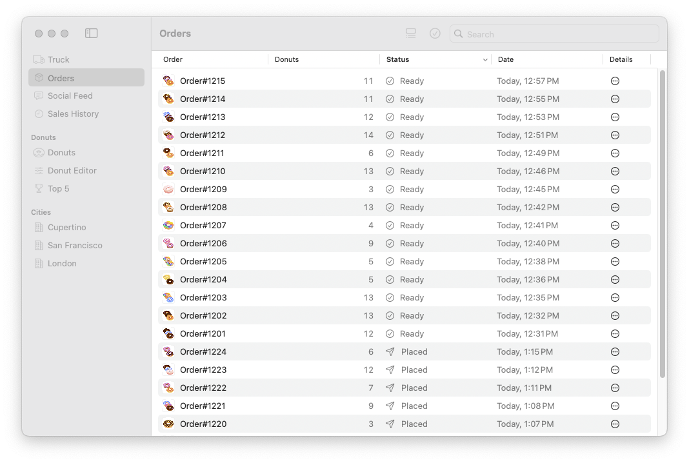

# ImmutableData-FoodTruck

Incrementally Migrating State Management for SwiftUI Apps

## Background

Drawing on over a decade of experience shipping products at scale using declarative UI frameworks, we present a new application architecture for SwiftUI. Using the Flux and Redux architectures as a philosophical prior art, we can design an architecture using modern Swift and specialized for modern SwiftUI. This architecture encourages *declarative* thinking instead of *imperative* thinking, *functional* programming instead of object-oriented programming, and *immutable* model values instead of mutable model objects.

At the core of the architecture is a unidirectional data flow:


All global state data flows through the application following this basic pattern, and a strict separation of concerns is enforced. The actions *declare* what has occurred, whether user input, a server response, or a change in a device’s sensors, but they have no knowledge of the state or view layers. The state layer *reacts* to the “news” described by the action and updates the state accordingly. All logic for making changes to the state is contained within the state layer, but it knows nothing of the view layer. The views then *react* to the changes in the state layer as the new state flows through the component tree. Again, however, the view layer knows nothing about the state layer. By maintaining this strict unidirectional data flow and separation of concerns, our application code becomes easier to test, easier to reason about, easier to explain to new team members, and easier to update when new features are required.

Further, avoiding complexity like two-way data bindings, or the spaghetti engendered by mutability, allows our code to become clean, fast, and maintainable. This is the key difference between this application framework (and the ideas behind it) and other presentations of actions, state, and view previously shown at WWDC.[^1] By avoiding direct mutations called from outside the state layer and embracing immutability instead, complexity vanishes and our code becomes much more robust.

[*The ImmutableData Programming Guide*](https://github.com/Swift-ImmutableData/ImmutableData-Book) is the definitive reference for learning `ImmutableData`. The Programming Guide teaches important concepts and philosophy before building the infra from scratch. The Programming Guide then builds sample application products from scratch. These products teach us a lot… but we also understand that not all engineers have the ability to always build new products from scratch. Some of us work on teams and products built on “legacy” code. These products might be using SwiftUI to manage views, but the code to manage data models could be MVC, MVVM, or another variety of a “MV*” architecture.

Suppose we can’t just “throw away” our code all at once. Suppose we are a product engineer on a large team and a large application and we want to *incrementally* migrate our application to the `ImmutableData` architecture. We want to migrate a *subset* of the product surfaces, but we don’t want to break the *remaining* product surfaces: those surfaces need to continue using the legacy architecture.

Over the course of this tutorial, we will incrementally migrate a SwiftUI application to the `ImmutableData` infra. We will fix bugs, add new features, and *significantly* improve the design and implementation of our view components. We improve performance for components by controlling expensive operations needed for computing `body`. We will even see how this incremental migration improves product engineering across our legacy product surfaces: surfaces that don’t migrate to `ImmutableData` *still* see real-world benefits from our changes.

Let’s also set some reasonable expectations: this is going to take some more code. Over the course of this tutorial, we will add about 1500 lines of Swift to our project. This project started with 8579 lines of Swift; we’re not *doubling* our code, but it’s also not a trivial amount of work. To be fair, that new code also includes bug fixes and new features: we are not just *preserving* functionality from our legacy architecture, we are *improving* and *extending* functionality.

Let’s think back to one of our engineering principles we introduced in *The ImmutableData Programming Guide*: We prefer simple code instead of less code. The primary goal of migrating to `ImmutableData` should not be to reduce the total amount of code in your project. If it *does* happen… it’s a great side effect. Our primary goal is to reduce *complexity*. Our code becomes easier to reason about and easier to make changes to.

## Requirements

Our intended audience for this tutorial is product engineers that have already read through *The ImmutableData Programming Guide*, which is the best place to learn about the underlying concepts of the `ImmutableData` infra. If this is your first time hearing about `ImmutableData`, you might have an easier time if you start with the Programming Guide before attempting this tutorial.

Our goal is to teach a new way of thinking about state management and data flow for SwiftUI. Our goal *is not* to teach Swift Programming or the basics of SwiftUI. You should have a strong competency in Swift 6.0 before beginning this tutorial. You should also have a working familiarity with SwiftUI.

The `ImmutableData-FoodTruck` application deploys to the following platforms:
* iOS 16.4+
* iPadOS 16.4+
* macOS 13.3+

Building the `ImmutableData-FoodTruck` application requires Xcode 16.0+ and macOS 14.5+.

Please file a GitHub issue if you encounter any compatibility problems.

## Instructions

Our repo is a fork of [`sample-food-truck`](https://github.com/apple/sample-food-truck) from Apple. Go ahead and try building from `main` to see what the app looks like before we make our changes. If you see a code signing error, try following the steps from Apple to choose a certificate for local development and specify your development team.[^2]

Here is a screenshot of the main `TruckView` component from macOS:

<picture>
 <source media="(prefers-color-scheme: light)" srcset="./Assets/01-light.png">
 <source media="(prefers-color-scheme: dark)" srcset="./Assets/01-dark.png">
 
</picture>

Food Truck was built for WWDC 2022. It’s built on SwiftUI and includes support for Live Activities.[^3] The data models are built from immutable struct values, but are stored in an object reference that our components depend on. When our component needs to mutate the global state of our system, our component performs an imperative mutation *directly* on this source of truth. We could debate back and forth what the precise “name” of this architecture is: is it “MVC”, “MVVM”, “MV”, or MV-Whatever. Whatever this architecture is called, there are two concepts we *don’t* want to ship more of in our view components: imperative logic and mutability.

Let’s think back to *The ImmutableData Programming Guide*: we want to *think declaratively* as we build view components. We want to declare our intent to the SwiftUI infra when state updates and we should display new data, and we want to declare our intent to the `ImmutableData` infra when user events happen that might transform our global application state.

The version of Food Truck released by Apple does a good job demonstrating how a product engineer might use SwiftUI to put views on screen. Unfortunately, our application has some bugs related to our data models. Let’s see what happens when we edit the name or ingredients of a `Donut` value. We start with navigating to `DonutGallery`:

<picture>
 <source media="(prefers-color-scheme: light)" srcset="./Assets/02-light.png">
 <source media="(prefers-color-scheme: dark)" srcset="./Assets/02-dark.png">
 
</picture>

We navigate to `DonutEditor` to edit a `Donut` value:

<picture>
 <source media="(prefers-color-scheme: light)" srcset="./Assets/03-light.png">
 <source media="(prefers-color-scheme: dark)" srcset="./Assets/03-dark.png">
 
</picture>

From macOS, we can now open a new window (`⌘ N`) that *should* display the same state. Keep this new window on the `TruckView` component. What happens if we edit one of the ingredients of our `Donut` value from the next window? This should affect what we see displayed the rest of the places where that same `Donut` value is being used. What we *actually* see from `TruckView` is data is now stale. The `TruckOrdersCard` that displays thumbnail images for `Donut` values on each `Order` displays the *old* ingredients. The `TruckDonutsCard` that displays thumbnail images for *all* `Donut` values *did* update as we made our edits on the `Donut`. What happened?

Our `Donut` and `Order` values are *immutable* `struct` values. Making an “edit” on a `Donut` value produces a *new* value. Because our `Order` has an associated `Array` of `Donut` values, those `Donut` values are stale if we made an edit somewhere else. At this point, we have more than once “source of truth”.

We can see this same kind of bug happen across more product surfaces. Try opening the `OrderDetailView` component on an `Order` value:

<picture>
 <source media="(prefers-color-scheme: light)" srcset="./Assets/04-light.png">
 <source media="(prefers-color-scheme: dark)" srcset="./Assets/04-dark.png">
 
</picture>

If we open `DonutEditor` and edit one of the `Donut` values associated with this `Order`, we see the `Donut` does not update to reflect the correct state.

We can mark an `Order` as `completed` from `OrderDetailView`. This displays the `OrderCompleteView` component:

<picture>
 <source media="(prefers-color-scheme: light)" srcset="./Assets/05-light.png">
 <source media="(prefers-color-scheme: dark)" srcset="./Assets/05-dark.png">
 
</picture>

If we open `DonutEditor` and edit the ingredients of the `Donut` displayed in `OrderCompleteView`, we see the `Donut` does not update to reflect the correct state.

The `OrdersView` displays all `Order` values:

<picture>
 <source media="(prefers-color-scheme: light)" srcset="./Assets/06-light.png">
 <source media="(prefers-color-scheme: dark)" srcset="./Assets/06-dark.png">
 
</picture>

The small `DonutStackView` that displays `Donut` thumbnails does not update to reflect the correct state if we edit the ingredients of those `Donut` values.

While we were tracking down these bugs, our product managers came to us with an important new feature we need to ship. Our `FoodTruckModel` contains some code to generate pseudo-random `Order` values over the lifecycle of our app. We want to add a button to `OrdersView` for our user to explicitly generate a new `Order`.

One of our customers wrote back with another place we need to support new functionality. When we select an `Order` from `OrderDetailView` and mark the status that `Order` as `preparing`, we start a Live Activity on iPhone and iPad. If we mark the status of that same `Order` as `completed`, we end the Live Activity. The problem is that there is actually more than one place to mark an `Order` as `completed` on iPad. If we mark an `Order` as `preparing` from `OrderDetailView` and mark that same `Order` as `completed` from `OrdersTable` or `OrdersView`, we are *not* ending the Live Activity. It’s only `OrderDetailView` that is correctly ending the Live Activity. We want to update our application so that Live Activities are ended when an `Order` transitions to `completed` from *any* component.

We have some bugs to fix and some new features to ship. At this point, we don’t necessarily *need* to rethink our architecture. Could we just “write a bunch of code” and not attempt an incremental migration to `ImmutableData`? Maybe… but *what kind of code* are we going to be writing?

* Do we build *more* imperative logic in our view components?
* Do we build *more* mutability on our data models to expose to our view components?

We *could* write this code… and we would also *increase* the complexity of how these components display and mutate state over time. Adding more data models, more components, and more engineers increases that complexity as our app scales over time.

Throwing more code at our problems is a short-term fix if we don’t stop and think through how this legacy architecture introduces complexity. It’s not just “this app has bugs” or “this app needs a new feature”. It’s that the code we would write to fix those bugs or add those new features continues us down a path we don’t want:

* We don’t want *more* imperative logic in our view components. We want *less* imperative logic.
* We don’t want *more* mutability in our view components. We want *less* mutability.

Let’s see how `ImmutableData` can be adopted incrementally. We’re not going to rewrite the entire app all at once. We’re going to show how individual product surfaces can be migrated to `ImmutableData` and coexist along with product surfaces built on a legacy infra.

The `migration` branch has all the changes in this tutorial. If you wanted to “skip ahead” you can checkout this branch to see for yourself what we are going to build. If you are ready to begin this tutorial, you can checkout the `main` branch to build all these changes directly on the original source code from Apple.

Let’s get started!

## FoodTruckKit

Let’s begin with two new dependencies added to our `FoodTruckKit` package manifest. One dependency will be `ImmutableData-Legacy` for the core `ImmutableData` infra. Our second dependency will be `swift-algorithms` for one specialized algorithm we use to improve performance when sorting.

Our `ImmutableData` infra requires building from Swift 6.0 and up. Let’s start with adding that requirement on our package manifest. Select the `FoodTruckKit` package and open `Package.swift`:

```diff
//  Package.swift

-// swift-tools-version: 5.7
+// swift-tools-version: 6.0
```

We can now add our dependencies to our package:

```diff
//  Package.swift

let package = Package(
    ...
-    dependencies: [],
+    dependencies: [
+      .package(
+          url: "https://github.com/apple/swift-algorithms.git",
+          from: "1.2.1"
+      ),
+      .package(
+          url: "https://github.com/Swift-ImmutableData/ImmutableData-Legacy.git",
+          from: "0.3.0"
+      ),
+  ],
```

Our Food Truck app was originally built for WWDC 2022. The `ImmutableData` infra depends on runtimes released at WWDC 2023. We import the `ImmutableData-Legacy` infra to depend on older runtimes. The `ImmutableData-Legacy` infra offers a subset of the functionality of the `ImmutableData` infra. The biggest change is that Dependency Selectors do not support variadic parameter packs: we can only choose one Dependency Selector for this version.

We can now add our dependencies to our target:

```diff
//  Package.swift

let package = Package(
    ...
    targets: [
        .target(
            name: "FoodTruckKit",
-            dependencies: [],
+            dependencies: [
+                .product(
+                    name: "Algorithms",
+                    package: "swift-algorithms"
+                ),
+                .product(
+                    name: "ImmutableData",
+                    package: "ImmutableData-Legacy"
+                ),
+                .product(
+                    name: "ImmutableUI",
+                    package: "ImmutableData-Legacy"
+                ),
+            ],
```

Requiring Swift 6.0 on our package manifest will enable Strict Concurrency Checking. This is a legacy package and Strict Concurrency Checking might give us many warnings and errors. Fixing these warnings and errors is a good idea, but this is orthogonal to our goal of teaching the `ImmutableData` infra. We will disable Strict Concurrency Checking for this tutorial:

```diff
//  Package.swift

let package = Package(
    ...
    targets: [
    ...
-    ]
+    ],
+    swiftLanguageModes: [
+        .v5
+    ]
```

## FoodTruckState

The first step to migrating our Food Truck app to the `ImmutableData` infra is to define our State. This will represent the global state of our data models. Consistent with *The ImmutableData Programming Guide*, we continue to keep local state defined directly in our component tree. Our global state is for the “core data” of our application.

Our incremental migration will focus on two data models: Orders and Donuts. These will be the two most important data models used in our component tree. Over the course of this tutorial we will migrate component trees away from performing queries and mutations directly on `FoodTruckModel`. We can then use the `ImmutableData` infra to select Orders and Donuts and transform state through a unidirectional data flow.

Select the `FoodTruckKit` package and add a new directory under `Sources`. Name this directory `ImmutableData`. Add a new Swift file under `FoodTruckKit/Sources/ImmutableData`. Name this file `FoodTruckState.swift`.

Here’s the first step to building our `FoodTruckState`:

```swift
//  FoodTruckState.swift

import Foundation

public struct FoodTruckState {
  var orders = [Order.ID: Order]()
  var donuts = [Donut.ID: Donut]()
  
  public init() {
    
  }
}
```

Consistent with *The ImmutableData Programming Guide* we choose to save our data models as normalized `Dictionary` values similar to tables in a database.

When testing our Food Truck application we saw multiple bugs where the state of our application became stale and incorrect. This happened when mutating `Donut` values while we were displaying `Order` values. Those `Order` values saved `Donut` values as properties. Because our `Donut` values are immutable structs, performing a mutation on the “source of truth” of our `Donut` values was not updating the `Order` values that already saved values for the same `Donut.ID`.

For `FoodTruckState` we will save a `Dictionary` value of `Order` values. When our component tree needs to display `Order` values, we will then go back to our current `Donut` values and update the `Order` values before returning them to our Selectors. This is how selecting `Order` values from `ImmutableData` will display correct data. If a component dispatches an Action value that transforms the `Donut` values, our components that depend on the `Order` values will then select the current `Donut` values to keep the component tree consistent with the global state of our application.

Our `FoodTruckState` stores a `Dictionary` of `Order` values, but this is a shortcut. We don’t really care about the `Order` value as it is currently defined in `FoodTruckKit`. The current `Order` saves `Donut` values as properties. For the purposes of our `ImmutableData` state, all we should care about is that our `Order` values save `Donut.ID` values.

We don’t really need to save the existing `Order` values. We would prefer to save a “transformation” of the `Order` values: some kind of `Order.BackingData` value that preserved all the data of a normal `Order`, but transformed the relationship of `Donut` values to only save `Donut.ID` values.

How would we construct `Order.BackingData`? We could choose to build it by hand. We would define a new `Order.BackingData` struct type, copy all the properties over, and save `Donut.ID` values instead of `Donut` values. This might not be so bad for just one type, but this could slow us down as we define many types in our system to save in `ImmutableData`.

A more elegant solution could be to leverage a macro to codegen these `BackingData` types for us: we could attach a macro to a type like `Order` and the macro would then generate the appropriate `Order.BackingData` type for us at compile time.

These are interesting ideas and important to consider as we scale the complexity of our application, but we don’t need to block our incremental migration tutorial on this. We will keep moving forward without the extra `Order.BackingData` type. This does mean we are saving more data in our `Dictionary` than is necessary. We will file a mental `TODO` to come back and investigate new ways to save normalized data efficiently after our incremental migration is complete.

One of the advantages of keeping global state in `ImmutableData` is that our Selectors give us a natural “abstraction layer” over the primitive state of our system. If we did migrate our `FoodTruckState` to save tables of `Order.BackingData` values, that would be a private implementation detail that would not need to be exposed to our component trees. Because our component trees query for state through selectors, our component trees are not strongly coupled to the primitive state of our system. We would have to update our selectors to transform `Order.BackingData` values to `Order` values before returning data to our components, but the components *themselves* do not need to be refactored.

Let’s continue building on `FoodTruckState` and start adding selector functions. We begin with utilities to select a dictionary of `Order` values *and* the current `Donut` values for every `Order`:

```swift
//  FoodTruckState.swift

extension FoodTruckState {
  fileprivate func selectDonut(donutID: Donut.ID) -> Donut? {
    self.donuts[donutID]
  }
}

extension FoodTruckState {
  fileprivate func selectDonuts(order: Order) -> [Donut] {
    order.donuts.compactMap { donut in
      self.selectDonut(donutID: donut.id)
    }
  }
}

extension FoodTruckState {
  fileprivate func selectOrders() -> [Order.ID: Order] {
    self.orders.mapValues { order in
      var order = order
      order.donuts = self.selectDonuts(order: order)
      return order
    }
  }
}
```

Our component trees will need the ability to search and filter for `Order` values with a `String`. Let’s add this on top of the work we just added:

```swift
//  FoodTruckState.swift

extension FoodTruckState {
  fileprivate func selectOrders(searchText: String) -> [Order.ID: Order] {
    if searchText.isEmpty {
      return self.selectOrders()
    }
    return self.selectOrders().filter { (key, value) in
      value.matches(searchText: searchText) || value.donuts.contains(where: { $0.matches(searchText: searchText) })
    }
  }
}

extension FoodTruckState {
  public static func selectOrders(searchText: String) -> @Sendable (Self) -> [Order.ID: Order] {
    { state in state.selectOrders(searchText: searchText) }
  }
}
```

Our `OrdersView` component will also need the ability to sort `Order` values. Here’s what that looks like:

```swift
//  FoodTruckState.swift

extension FoodTruckState {
  fileprivate func selectOrdersValues<S: Sequence>(
    searchText: String,
    using sortOrder: S
  ) -> [Order]
  where S.Element == KeyPathComparator<Order> {
    self.selectOrders(searchText: searchText).values.sorted(using: sortOrder)
  }
}

extension FoodTruckState {
  public static func selectOrdersValues<S: Sequence>(
    searchText: String,
    using sortOrder: S
  ) -> @Sendable (Self) -> [Order]
  where S.Element == KeyPathComparator<Order> {
    { state in
      state.selectOrdersValues(
        searchText: searchText,
        using: sortOrder
      )
    }
  }
}
```

Our `TruckOrdersCard` will also sort `Order` values, but `TruckOrdersCard` will only display a small subset of `Order` values. We could sort all `Order` values, return those `Order` values to `TruckOrdersCard`, and then display the first `k` orders, but this is inefficient. We would be paying for a `O(n log n)` operation to sort *all* `n` orders. A more efficient algorithm is to return the first `k` orders *without* sorting all `n` orders.

We could write this algorithm ourselves, but we will depend on `swift-algorithms` to save us some time. Let’s add two utility methods on `Sequence` that will help us build our selector. Add a new Swift file under `FoodTruckKit/Sources/ImmutableData`. Name this file `SequenceUtils.swift`:

```swift
//  SequenceUtils.swift

import Algorithms
import Foundation

extension Sequence {
  func min<Comparator: SortComparator>(
    count: Int,
    using comparator: Comparator
  ) -> [Element]
  where Element == Comparator.Compared {
    self.min(count: count) {
      comparator.compare($0, $1) == .orderedAscending
    }
  }
}

extension Sequence {
  func min<S: Sequence, Comparator: SortComparator>(
    count: Int,
    using comparators: S
  ) -> [Element]
  where Element == Comparator.Compared, S.Element == Comparator {
    self.min(count: count) {
      comparators.compare($0, $1) == .orderedAscending
    }
  }
}
```

These utilities will help us when our sorting algorithms depend on `Foundation.SortComparator`.

We can now return to `FoodTruckState` and add the selector to return only the first `k` orders for `TruckOrdersCard`:

```swift
//  FoodTruckState.swift

extension FoodTruckState {
  fileprivate func selectOrdersValues<S: Sequence>(
    searchText: String,
    min count: Int,
    using sortOrder: S
  ) -> [Order]
  where S.Element == KeyPathComparator<Order> {
    self.selectOrders(searchText: searchText).values.min(
      count: count,
      using: sortOrder
    )
  }
}

extension FoodTruckState {
  public static func selectOrdersValues<S: Sequence>(
    searchText: String,
    min count: Int,
    using sortOrder: S
  ) -> @Sendable (Self) -> [Order]
  where S.Element == KeyPathComparator<Order> {
    { state in
      state.selectOrdersValues(
        searchText: searchText,
        min: count,
        using: sortOrder
      )
    }
  }
}
```

When we display orders in a `OrdersTable`, a user has the option to select orders and mark those orders as completed. It doesn’t make a lot of sense for orders that are *already* completed to be marked as completed again. We want our component to be able to select the `OrderStatus` values for a set of `Order.ID` values. We can then use those values to control whether or not a user has the option to mark that selection as completed.

There a small utility method on `Dictionary` that will help us moving forward. Add a new Swift file under `FoodTruckKit/Sources/ImmutableData`. Name this file `DictionaryUtils.swift`:

```swift
//  DictionaryUtils.swift

extension Dictionary {
  init<S: Sequence>(_ values: S)
  where Key == Value.ID, Value: Identifiable, S.Element == Value {
    self.init(
      uniqueKeysWithValues: values.map { element in
        (element.id, element)
      }
    )
  }
}
```

Here is our selector:

```swift
//  FoodTruckState.swift

extension FoodTruckState {
  fileprivate func selectOrdersStatuses<S: Sequence>(orderIDs: S) -> [Order.ID: OrderStatus]
  where S.Element == Order.ID {
    Dictionary(orderIDs.compactMap { self.orders[$0] }).mapValues { $0.status }
  }
}

extension FoodTruckState {
  public static func selectOrdersStatuses<S: Sequence>(orderIDs: S) -> @Sendable (Self) -> [Order.ID: OrderStatus]
  where S.Element == Order.ID {
    { state in state.selectOrdersStatuses(orderIDs: orderIDs) }
  }
}
```

Our `OrderCompleteView` and `OrderDetailView` components will display data for just one `Order` value. Let’s add a selector for one `Order` value. Let’s also remember to select the current `Donut` values for that `Order`:

```swift
//  FoodTruckState.swift

extension FoodTruckState {
  fileprivate func selectOrder(orderID: Order.ID) -> Order? {
    guard
      var order = self.orders[orderID]
    else {
      return nil
    }
    order.donuts = self.selectDonuts(order: order)
    return order
  }
}

extension FoodTruckState {
  public static func selectOrder(orderID: Order.ID) -> @Sendable (Self) -> Order? {
    { state in state.selectOrder(orderID: orderID) }
  }
}
```

## FoodTruckAction

Our next step is to define the `FoodTruckAction` values we will dispatch back to our Reducer function. Add a new Swift file under `FoodTruckKit/Sources/ImmutableData`. Name this file `FoodTruckAction.swift`:

```swift
//  FoodTruckAction.swift

public enum FoodTruckAction {
  case ui(_ action: UI)
  case data(_ action: Data)
}
```

We follow a similar pattern from our *The ImmutableData Programming Guide*. We “scope” our action values down by their origin: `UI` actions and `Data` actions.

Our `UI` actions will dispatch from our component tree when a user event happens that might affect a transformation on our global state:

* A user taps the Status button from the `OrderDetailView` component to move an `Order` value to the next `OrderStatus` step.
* A user taps the Complete Order button from the `OrdersView` component to move an `Order` value to the `OrderStatus.completed` step.
* A user taps the Add Order button from the `OrdersView` component to generate a new random `Order` value.

Here is what those three action values look like:

```swift
//  FoodTruckAction.swift

extension FoodTruckAction {
  public enum UI {
    case orderDetailView(_ action: OrderDetailView)
    case ordersView(_ action: OrdersView)
  }
}

extension FoodTruckAction.UI {
  public enum OrderDetailView {
    case onTapStatusButton(orderID: Order.ID)
  }
}

extension FoodTruckAction.UI {
  public enum OrdersView {
    case onTapCompleteOrderButton(orderID: Order.ID)
    case onTapAddOrderButton
  }
}
```

The `onTapStatusButton` and `onTapCompleteOrderButton` actions both deliver associated values: we need to communicate the `Order.ID` associated with this action. The `onTapAddOrderButton` delivers no associated value. Because we generate these orders randomly from inside `FoodTruckModel`, we don’t need to deliver any data from our component.

Our `Data` actions will dispatch from our Listener when data has changed on our `FoodTruckModel`. We will create a `ModelListener` class and our `FoodTruckModel` will notify `ModelListener` when it has new data. Our `ModelListener` can then dispatch Action values back to our Reducer function.

Incremental migrations can be tricky: some product surfaces will migrate to a unidirectional data flow and some product surfaces will continue to perform imperative mutations directly on our `FoodTruckModel`. Our plan will be for `FoodTruckModel` to continue to be the “source of truth” of our application. Product surfaces can continue to perform imperative mutations directly on our `FoodTruckModel`. Product surfaces on a unidirectional data flow can then deliver the new state to our components after `FoodTruckModel` has been updated.

Our `ModelListener` is built for managing this data flow. We will build this later. For now we can just add the Action values that will be dispatched from `ModelListener`:

```swift
//  FoodTruckAction.swift

extension FoodTruckAction {
  public enum Data {
    case modelListener(_ action: ModelListener)
  }
}

extension FoodTruckAction.Data {
  public enum ModelListener {
    case didReceiveOrders(_ orders: [Order])
    case didReceiveDonuts(_ donuts: [Donut])
  }
}
```

## FoodTruckReducer

Our Reducer function is the only place in our unidirectional data flow where global state is transformed. Because this is an incremental migration, this is *not* the only place in our application where global state is transformed. Our `FoodTruckModel` will continue to be mutated with imperative logic directly by certain components and product surfaces.

What we will see is that as we expand the scope of our incremental migration we can begin to “roll back” the reach of `FoodTruckModel`. Component subtrees that previously depended on `FoodTruckModel` to read and write global state can eliminate the dependency on `FoodTruckModel`. As the number of ways we need to use `FoodTruckModel` decreases we can start to remove mutability that needs to be exposed to our component subtrees.

For now we can build `FoodTruckReducer` using similar patterns we saw from *The ImmutableData Programming Guide*. Reducers are pure functions free of side effects. Reducers return a new state value after action values are dispatched.

Add a new Swift file under `FoodTruckKit/Sources/ImmutableData`. Name this file `FoodTruckReducer.swift`:

```swift
//  FoodTruckReducer.swift

public enum FoodTruckReducer {
  @Sendable public static func reduce(
    state: FoodTruckState,
    action: FoodTruckAction
  ) throws -> FoodTruckState {
    switch action {
    case .ui(let action):
      return try self.reduce(state: state, action: action)
    case .data(let action):
      return try self.reduce(state: state, action: action)
    }
  }
}
```

The `UI` action domain is not intended to transform our global state directly. We will later see how the `UI` action domain can “pass through” to affect change directly on our `FoodTruckModel`. For now we can just return the identity transformation: we return the same state back with no transformations applied.

```swift
//  FoodTruckReducer.swift

extension FoodTruckReducer {
  private static func reduce(
    state: FoodTruckState,
    action: FoodTruckAction.UI
  ) throws -> FoodTruckState {
    state
  }
}
```

The `Data` domain represents actions that were sent back from our `ModelListener`. This will be the way we communicate changes from `FoodTruckModel` back to our `ImmutableData` infra.

When `FoodTruckModel` reports a change in `Order` values, we transform those `Order` values to a `Dictionary` with the utility helper we built. We perform a similar operation on a change in `Donut` values:

```swift
//  FoodTruckReducer.swift

extension FoodTruckReducer {
  private static func reduce(
    state: FoodTruckState,
    action: FoodTruckAction.Data
  ) throws -> FoodTruckState {
    switch action {
    case .modelListener(.didReceiveOrders(let orders)):
      var state = state
      state.orders = Dictionary(orders)
      return state
    case .modelListener(.didReceiveDonuts(let donuts)):
      var state = state
      state.donuts = Dictionary(donuts)
      return state
    }
  }
}
```

This implies that every mutation on one `Order` value leads to a `O(n)` operation in our `FoodTruckReducer`. This can lead to slow performance when our `FoodTruckModel` manages many `Order` values. At production scale we would like a way to update our `ImmutableData` state incrementally without replacing the entire `Dictionary` of values.

The biggest advantage of this approach is that we don’t have to refactor any code on `FoodTruckModel`: we can use the existing `Published` declarations on `FoodTruckModel` to detect when `Order` values have changed.

Let’s continue with this approach for the purposes of our incremental tutorial. At production scale we can think of two approaches that might optimize performance:

* Update the `FoodTruckModel` to publish more details about the specific changes on every mutation.
* Complete the migration to `ImmutableData` and this code is no longer needed when `FoodTruckModel` can be deleted.

## FoodTruckFilter

Dispatching action values to our Reducer will lead to our Selectors comparing State to determine if Output values should be recomputed. If those Selectors need to compare State as a `O(n)` operation, we can improve performance by using a Filter to tell our Selectors what action values would *never* lead to an Output value changing.

Add a new Swift file under `FoodTruckKit/Sources/ImmutableData`. Name this file `FoodTruckFilter.swift`:

```swift
//  FoodTruckFilter.swift

public enum FoodTruckFilter {
  public static func filterOrders() -> @Sendable (FoodTruckState, FoodTruckAction) -> Bool {
    { oldState, action in
      switch action {
      case .ui:
        false
      case .data:
        true
      }
    }
  }
}
```

This is simple. For any actions from our `UI` domain we return `false` to indicate this action would never lead to an `Order` value changing. Our Reducer treats these action values as pass-through: we don’t actually perform any transformation on state when these actions are dispatched.

For any actions from our `Data` domain we return `true` to indicate this action could lead to an `Order` value changing. Our `Data` domain defines two actions:

* The `didReceiveOrders` action will imply the `FoodTruckModel` has just performed a mutation on its `Array` of `Order` values.
* The `didReceiveDonuts` action will imply the `FoodTruckModel` has just performed a mutation on its `Array` of `Donut` values. Because our selectors that return `Order` values will *also* select the current `Donut` values needed for that `Order`, this action implies that the `Order` value returned by a selector might change.

## ModelListener

Our `FoodTruckModel` will remain our source of truth through our incremental migration. Product surfaces in our component tree can continue mutating `FoodTruckModel` state while our migration is in progress. When our `FoodTruckModel` state mutates, the `Published` declarations give us an ability to react to those mutations. When we dispatch action values from `ModelListener` back to `FoodTruckReducer`, we update our `FoodTruckState` value and display new state in our view components.

Add a new Swift file under `FoodTruckKit/Sources/ImmutableData`. Name this file `ModelListener.swift`:

```swift
//  ModelListener.swift

import Combine
import ImmutableData

@MainActor public final class ModelListener {
  private weak var model: FoodTruckModel?
  private var ordersTask: Task<Void, any Error>?
  private var donutsTask: Task<Void, any Error>?
  
  public init() {
    
  }
  
  deinit {
    self.ordersTask?.cancel()
    self.donutsTask?.cancel()
  }
}
```

Our main declaration has three properties: one optional `FoodTruckModel` reference and two optional `Task` values.

Here’s a method we declare for reacting to new `Order` values:

```swift
//  ModelListener.swift

extension ModelListener {
  private func listen<S: AsyncSequence>(
    to values: S,
    with dispatcher: some ImmutableData.Dispatcher<FoodTruckState, FoodTruckAction>
  )
  where S.Element == [Order] {
    self.ordersTask?.cancel()
    self.ordersTask = Task {
      for try await orders in values {
        try dispatcher.dispatch(
          action: .data(.modelListener(.didReceiveOrders(orders)))
        )
      }
    }
  }
}
```

The `values` parameter is an `AsyncSequence`: every element is an `Array` of `Order` values. Every time we receive an `Array` from `values` we then dispatch an action value to our `dispatcher`.

Here’s a method we declare for reacting to new `Donut` values:

```swift
//  ModelListener.swift

extension ModelListener {
  private func listen<S: AsyncSequence>(
    to values: S,
    with dispatcher: some ImmutableData.Dispatcher<FoodTruckState, FoodTruckAction>
  )
  where S.Element == [Donut] {
    self.donutsTask?.cancel()
    self.donutsTask = Task {
      for try await donuts in values {
        try dispatcher.dispatch(
          action: .data(.modelListener(.didReceiveDonuts(donuts)))
        )
      }
    }
  }
}
```

And here is the `public` method on `ModelListener` to begin these operations:

```swift
//  ModelListener.swift

extension ModelListener {
  public func listen(
    to model: FoodTruckModel,
    with dispatcher: some ImmutableData.Dispatcher<FoodTruckState, FoodTruckAction>
  ) {
    if self.model !== model {
      self.model = model
      self.listen(
        to: model.$orders.values,
        with: dispatcher
      )
      self.listen(
        to: model.$donuts.values,
        with: dispatcher
      )
    }
  }
}
```

The `orders` and `donuts` properties on `FoodTruckModel` are both `Published` through Combine. We can then construct an `AsyncPublisher` from the `projectedValue` and `values` properties.

## StoreKey

Before we start to focus on our component trees, let’s define some constructors to help us use `ImmutableUI`. Select the `FoodTruckKit` package and add a new directory under `Sources`. Name this directory `ImmutableUI`. Add a new Swift file under `FoodTruckKit/Sources/ImmutableUI`. Name this file `StoreKey.swift`.

We start by defining an `EnvironmentKey` and updating `EnvironmentValues` with a new property:

```swift
//  StoreKey.swift

import ImmutableData
import ImmutableUI
import SwiftUI

@MainActor fileprivate struct StoreKey: @preconcurrency EnvironmentKey {
  static let defaultValue = ImmutableData.Store(
    initialState: FoodTruckState(),
    reducer: FoodTruckReducer.reduce
  )
}

extension EnvironmentValues {
  fileprivate var store: ImmutableData.Store<FoodTruckState, FoodTruckAction> {
    get {
      self[StoreKey.self]
    }
    set {
      self[StoreKey.self] = newValue
    }
  }
}
```

We can now define a new constructor on `ImmutableUI.Provider` for this new `EnvironmentValues` property:

```swift
//  StoreKey.swift

extension ImmutableUI.Provider {
  public init(
    _ store: Store,
    @ViewBuilder content: () -> Content
  )
  where Store == ImmutableData.Store<FoodTruckState, FoodTruckAction> {
    self.init(
      \.store,
       store,
       content: content
    )
  }
}
```

We saw this pattern in *The ImmutableData Programming Guide*. This saves us from passing an extra property when we use types from `ImmutableUI`. This also keeps the `StoreKey` environment value private: we don’t have to expose this to a wider audience. This also helps guarantee that product engineers on our team don’t make a mistake and use an incorrect environment value.

Here is a new constructor on `ImmutableUI.Dispatcher`:

```swift
//  StoreKey.swift

extension ImmutableUI.Dispatcher {
  public init()
  where Store == ImmutableData.Store<FoodTruckState, FoodTruckAction> {
    self.init(\.store)
  }
}
```

Here are four new constructors on `ImmutableUI.Selector`:

```swift
//  StoreKey.swift

extension ImmutableUI.Selector {
  public init(
    id: some Hashable,
    label: String? = nil,
    filter isIncluded: (@Sendable (Store.State, Store.Action) -> Bool)? = nil,
    dependencySelector: DependencySelector<Store.State, Dependency>,
    outputSelector: OutputSelector<Store.State, Output>
  )
  where Store == ImmutableData.Store<FoodTruckState, FoodTruckAction> {
    self.init(
      \.store,
       id: id,
       label: label,
       filter: isIncluded,
       dependencySelector: dependencySelector,
       outputSelector: outputSelector
    )
  }
}

extension ImmutableUI.Selector {
  public init(
    id: some Hashable,
    label: String? = nil,
    filter isIncluded: (@Sendable (Store.State, Store.Action) -> Bool)? = nil,
    outputSelector: OutputSelector<Store.State, Output>
  )
  where Store == ImmutableData.Store<FoodTruckState, FoodTruckAction>, Dependency == Never {
    self.init(
      \.store,
       id: id,
       label: label,
       filter: isIncluded,
       outputSelector: outputSelector
    )
  }
}

extension ImmutableUI.Selector {
  public init(
    label: String? = nil,
    filter isIncluded: (@Sendable (Store.State, Store.Action) -> Bool)? = nil,
    dependencySelector: DependencySelector<Store.State, Dependency>,
    outputSelector: OutputSelector<Store.State, Output>
  )
  where Store == ImmutableData.Store<FoodTruckState, FoodTruckAction> {
    self.init(
      \.store,
       label: label,
       filter: isIncluded,
       dependencySelector: dependencySelector,
       outputSelector: outputSelector
    )
  }
}

extension ImmutableUI.Selector {
  public init(
    label: String? = nil,
    filter isIncluded: (@Sendable (Store.State, Store.Action) -> Bool)? = nil,
    outputSelector: OutputSelector<Store.State, Output>
  )
  where Store == ImmutableData.Store<FoodTruckState, FoodTruckAction>, Dependency == Never {
    self.init(
      \.store,
       label: label,
       filter: isIncluded,
       outputSelector: outputSelector
    )
  }
}
```

## Dispatch

The `ImmutableUI.Dispatcher` property wrapper delivers a `ImmutableData.Dispatcher`. This dispatcher gives product engineers the ability to dispatch action values *and* asynchronous thunk operations. This offers a lot of flexibility, but we generally don’t want thunk operations to be dispatched directly from a view component. Let’s define a new property wrapper that only offers the ability to dispatch action values.

Add a new Swift file under `FoodTruckKit/Sources/ImmutableUI`. Name this file `Dispatch.swift`:

```swift
//  Dispatch.swift

import ImmutableData
import ImmutableUI
import SwiftUI

@MainActor @propertyWrapper public struct Dispatch: DynamicProperty {
  @ImmutableUI.Dispatcher() private var dispatcher
  
  public init() {
    
  }
  
  public var wrappedValue: (FoodTruckAction) throws -> Void {
    self.dispatcher.dispatch
  }
}
```

## Selector

When we use `ImmutableUI.Selector` from our components we provide an `OutputSelector` that computes a slice of state and accepts a closure to determine if two slices of state have changed. We have a similar option if we provide a `DependencySelector`. The ability to control precisely what operation our `Selector` uses to determine if two slices of state have changed offers a lot of flexibility. That also means product engineers would have to define that operation every place we use `ImmutableUI.Selector`.

A reasonable “default” operation to determine if two slices of state have changed is a value equality operator. Let’s see how we can provide that by default.

Add a new Swift file under `FoodTruckKit/Sources/ImmutableUI`. Name this file `Selector.swift`. Let’s begin with two new constructors on `DependencySelector` and `OutputSelector`.

```swift
//  Selector.swift

import ImmutableData
import ImmutableUI
import SwiftUI

extension ImmutableUI.DependencySelector {
  public init(select: @escaping @Sendable (State) -> Dependency)
  where Dependency: Equatable {
    self.init(select: select) { $0 != $1 }
  }
}

extension ImmutableUI.OutputSelector {
  public init(select: @escaping @Sendable (State) -> Output)
  where Output: Equatable {
    self.init(select: select) { $0 != $1 }
  }
}
```

When our slice of state is `Equatable`, we can now construct these types with only our selector closure and value equality will be used to determine if two slices have changed.

We can add four new constructors on `ImmutableUI.Selector`:

```swift
//  Selector.swift

extension ImmutableUI.Selector {
  public init(
    id: some Hashable,
    label: String? = nil,
    filter isIncluded: (@Sendable (Store.State, Store.Action) -> Bool)? = nil,
    dependencySelector: @escaping @Sendable (Store.State) -> Dependency,
    outputSelector: @escaping @Sendable (Store.State) -> Output
  )
  where Store == ImmutableData.Store<FoodTruckState, FoodTruckAction>, Dependency: Equatable, Output: Equatable {
    self.init(
      id: id,
      label: label,
      filter: isIncluded,
      dependencySelector: DependencySelector(select: dependencySelector),
      outputSelector: OutputSelector(select: outputSelector)
    )
  }
}

extension ImmutableUI.Selector {
  public init(
    id: some Hashable,
    label: String? = nil,
    filter isIncluded: (@Sendable (Store.State, Store.Action) -> Bool)? = nil,
    outputSelector: @escaping @Sendable (Store.State) -> Output
  )
  where Store == ImmutableData.Store<FoodTruckState, FoodTruckAction>, Dependency == Never, Output: Equatable {
    self.init(
      id: id,
      label: label,
      filter: isIncluded,
      outputSelector: OutputSelector(select: outputSelector)
    )
  }
}

extension ImmutableUI.Selector {
  public init(
    label: String? = nil,
    filter isIncluded: (@Sendable (Store.State, Store.Action) -> Bool)? = nil,
    dependencySelector: @escaping @Sendable (Store.State) -> Dependency,
    outputSelector: @escaping @Sendable (Store.State) -> Output
  )
  where Store == ImmutableData.Store<FoodTruckState, FoodTruckAction>, Dependency: Equatable, Output: Equatable {
    self.init(
      label: label,
      filter: isIncluded,
      dependencySelector: DependencySelector(select: dependencySelector),
      outputSelector: OutputSelector(select: outputSelector)
    )
  }
}

extension ImmutableUI.Selector {
  public init(
    label: String? = nil,
    filter isIncluded: (@Sendable (Store.State, Store.Action) -> Bool)? = nil,
    outputSelector: @escaping @Sendable (Store.State) -> Output
  )
  where Store == ImmutableData.Store<FoodTruckState, FoodTruckAction>, Dependency == Never, Output: Equatable {
    self.init(
      label: label,
      filter: isIncluded,
      outputSelector: OutputSelector(select: outputSelector)
    )
  }
}
```

We can add four new `update` methods:

```swift
//  Selector.swift

extension ImmutableUI.Selector {
  public mutating func update(
    id: some Hashable,
    label: String? = nil,
    filter isIncluded: (@Sendable (Store.State, Store.Action) -> Bool)? = nil,
    dependencySelector: @escaping @Sendable (Store.State) -> Dependency,
    outputSelector: @escaping @Sendable (Store.State) -> Output
  )
  where Store == ImmutableData.Store<FoodTruckState, FoodTruckAction>, Dependency: Equatable, Output: Equatable {
    self.update(
      id: id,
      label: label,
      filter: isIncluded,
      dependencySelector: DependencySelector(select: dependencySelector),
      outputSelector: OutputSelector(select: outputSelector)
    )
  }
}

extension ImmutableUI.Selector {
  public mutating func update(
    id: some Hashable,
    label: String? = nil,
    filter isIncluded: (@Sendable (Store.State, Store.Action) -> Bool)? = nil,
    outputSelector: @escaping @Sendable (Store.State) -> Output
  )
  where Store == ImmutableData.Store<FoodTruckState, FoodTruckAction>, Dependency == Never, Output: Equatable {
    self.update(
      id: id,
      label: label,
      filter: isIncluded,
      outputSelector: OutputSelector(select: outputSelector)
    )
  }
}

extension ImmutableUI.Selector {
  public mutating func update(
    label: String? = nil,
    filter isIncluded: (@Sendable (Store.State, Store.Action) -> Bool)? = nil,
    dependencySelector: @escaping @Sendable (Store.State) -> Dependency,
    outputSelector: @escaping @Sendable (Store.State) -> Output
  )
  where Store == ImmutableData.Store<FoodTruckState, FoodTruckAction>, Dependency: Equatable, Output: Equatable {
    self.update(
      label: label,
      filter: isIncluded,
      dependencySelector: DependencySelector(select: dependencySelector),
      outputSelector: OutputSelector(select: outputSelector)
    )
  }
}

extension ImmutableUI.Selector {
  public mutating func update(
    label: String? = nil,
    filter isIncluded: (@Sendable (Store.State, Store.Action) -> Bool)? = nil,
    outputSelector: @escaping @Sendable (Store.State) -> Output
  )
  where Store == ImmutableData.Store<FoodTruckState, FoodTruckAction>, Dependency == Never, Output: Equatable {
    self.update(
      label: label,
      filter: isIncluded,
      outputSelector: OutputSelector(select: outputSelector)
    )
  }
}
```

These `update` methods will be used when we want to dynamically adjust the behavior of a `Selector` at runtime.

Forcing `Selector` values to only use value equality might not be the right choice for every product surface. Product engineers still have the ability to pass their own custom `didChange` closure to `Selector` values.

## SelectOrdersValues

Our `TruckOrdersCard` and `OrdersView` components both display `Order` values in a sorted `Array`. These components currently fetch their `Order` values directly from a `FoodTruckModel` reference. Let’s build a Selector for these components to read `Order` values through `ImmutableData` with our unidirectional data flow.

Add a new Swift file under `FoodTruckKit/Sources/ImmutableUI`. Name this file `SelectOrdersValues.swift`.

We begin with a new `ID` type used to identify the current state of our `Selector`. If a user event should change the data we provide to our `Selector`, we can update our `ID` value to reflect the change. This new `ID` value will then cause our `Selector` to compute a new `Output` value.

```swift
//  SelectOrdersValues.swift

import ImmutableData
import ImmutableUI
import SwiftUI

fileprivate struct ID<S: Sequence & Hashable>: Hashable
where S.Element == KeyPathComparator<Order> {
  let searchText: String
  let count: Int?
  let sortOrder: S
  
  init(
    searchText: String,
    min count: Int? = nil,
    sortOrder: S
  ) {
    self.searchText = searchText
    self.count = count
    self.sortOrder = sortOrder
  }
}
```

We can now define a `SelectOrdersValues` property wrapper for our components:

```swift
//  SelectOrdersValues.swift

@MainActor @propertyWrapper public struct SelectOrdersValues: DynamicProperty {
  @ImmutableUI.Selector<ImmutableData.Store<FoodTruckState, FoodTruckAction>, [Order.ID: Order], [Order]> public var wrappedValue: [Order]
  
  public init<S: Sequence & Hashable>(
    searchText: String = "",
    using sortOrder: S
  )
  where S.Element == KeyPathComparator<Order> {
    self._wrappedValue = ImmutableUI.Selector(
      id: ID(
        searchText: searchText,
        sortOrder: sortOrder
      ),
      label: "SelectOrdersValues(searchText: \"\(searchText)\", using: \(sortOrder))",
      filter: FoodTruckFilter.filterOrders(),
      dependencySelector: FoodTruckState.selectOrders(
        searchText: searchText
      ),
      outputSelector: FoodTruckState.selectOrdersValues(
        searchText: searchText,
        using: sortOrder
      )
    )
  }
  
  public init<S: Sequence & Hashable>(
    searchText: String = "",
    min count: Int,
    using sortOrder: S
  )
  where S.Element == KeyPathComparator<Order> {
    self._wrappedValue = ImmutableUI.Selector(
      id: ID(
        searchText: searchText,
        min: count,
        sortOrder: sortOrder
      ),
      label: "SelectOrdersValues(searchText: \"\(searchText)\", min: \(count), using: \(sortOrder))",
      filter: FoodTruckFilter.filterOrders(),
      dependencySelector: FoodTruckState.selectOrders(
        searchText: searchText
      ),
      outputSelector: FoodTruckState.selectOrdersValues(
        searchText: searchText,
        min: count,
        using: sortOrder
      )
    )
  }
}
```

This might look like a lot of code. Let’s take a closer look.

* We start with our `wrappedValue` property. Our `SelectOrdersValues` returns an `Array` of `Order` values. Those values come from a `ImmutableUI.Selector`, which is generic across three types: a `Store`, a `Dependency`, and an `Output`. Our `Store` type is the same as the `Store` type we used to define our `EnvironmentValues` property. Our `Dependency` type is a `Dictionary` of `Order.ID` keys and `Order` values. Our `Output` type is an `Array` of `Order` values: this is returned as our `wrappedValue`.
* The first constructor accepts a `searchText` and a `sortOrder`. Our `searchText` parameter is a `String` value we use to filter `Order` values. Our `sortOrder` parameter is a `Sequence` of `KeyPathComparator<Order>` values we use to sort `Order` values.
* The second constructor adds a `min` parameter to indicate this `Selector` should *not* return the complete set of sorted `Order` values.
* Both constructors use `FoodTruckFilter` to reduce the amount of work performed. The `Output` of this `Selector` could only have changed when `FoodTruckFilter` returns `true`.
* Both constructors use the `Dictionary` of `Order.ID` keys and `Order` values as a `Dependency`. If this `Dependency` did not change from the last time we computed our `Output` value, we can return the same `Output` value without performing the work to sort those `Order` values again.

Those constructors accepts a `Sequence` of `KeyPathComparator<Order>` values. We might want the option to pass *just one* `KeyPathComparator<Order>` value from our component. Here are two new constructors that make this easier:

```swift
//  SelectOrdersValues.swift

extension SelectOrdersValues {
  public init(
    searchText: String = "",
    using sortOrder: KeyPathComparator<Order>
  ) {
    self.init(
      searchText: searchText,
      using: [sortOrder]
    )
  }
}

extension SelectOrdersValues {
  public init(
    searchText: String = "",
    min count: Int,
    using sortOrder: KeyPathComparator<Order>
  ) {
    self.init(
      searchText: searchText,
      min: count,
      using: [sortOrder]
    )
  }
}
```

There’s one more requirement for our `OrdersView` component. We will use `State` values to change `searchText` and `sortOrder` at runtime with bindings. This will need to `update` our `Selector` with the new `State` values:

```swift
//  SelectOrdersValues.swift

extension SelectOrdersValues {
  public mutating func update<S: Sequence & Hashable>(
    searchText: String = "",
    using sortOrder: S
  )
  where S.Element == KeyPathComparator<Order> {
    self._wrappedValue.update(
      id: ID(
        searchText: searchText,
        sortOrder: sortOrder
      ),
      label: "SelectOrdersValues(searchText: \"\(searchText)\", using: \(sortOrder))",
      filter: FoodTruckFilter.filterOrders(),
      dependencySelector: FoodTruckState.selectOrders(
        searchText: searchText
      ),
      outputSelector: FoodTruckState.selectOrdersValues(
        searchText: searchText,
        using: sortOrder
      )
    )
  }
}
```

## SelectOrdersStatuses

Our `OrdersTable` component gives users the option to select `Order` values. Once `Order` values are selected, our `OrdersView` component displays a button to mark those `Order` values as completed. We want a Selector for returning the `OrderStatus` values for a `Sequence` of `Order.ID` values. If a user selects `Order` values that are already complete, we don’t need to display a button to mark them complete again.

Add a new Swift file under `FoodTruckKit/Sources/ImmutableUI`. Name this file `SelectOrdersStatuses.swift`:

```swift
//  SelectOrdersStatuses.swift

import ImmutableData
import ImmutableUI
import SwiftUI

@MainActor @propertyWrapper public struct SelectOrdersStatuses: DynamicProperty {
  @ImmutableUI.Selector<ImmutableData.Store<FoodTruckState, FoodTruckAction>, Never, [Order.ID: OrderStatus]> public var wrappedValue: [Order.ID: OrderStatus]
  
  public init<S: Sequence & Hashable>(orderIDs: S)
  where S.Element == Order.ID {
    self._wrappedValue = ImmutableUI.Selector(
      id: orderIDs,
      label: "SelectOrdersStatuses(orderIDs: \(orderIDs))",
      filter: FoodTruckFilter.filterOrders(),
      outputSelector: FoodTruckState.selectOrdersStatuses(orderIDs: orderIDs)
    )
  }
}
```

A user might change their mind and select different `Order.ID` values. This will update a `State` value. We want this new value to `update` our `Selector`:

```swift
//  SelectOrdersStatuses.swift

extension SelectOrdersStatuses {
  public mutating func update<S: Sequence & Hashable>(orderIDs: S)
  where S.Element == Order.ID {
    self._wrappedValue.update(
      id: orderIDs,
      label: "SelectOrdersStatuses(orderIDs: \(orderIDs))",
      filter: FoodTruckFilter.filterOrders(),
      outputSelector: FoodTruckState.selectOrdersStatuses(orderIDs: orderIDs)
    )
  }
}
```

## SelectOrder

Our `OrderCompleteView` and `OrderDetailView` components will display data from one `Order` value. Let’s build a Selector that returns an `Order` for an `Order.ID`.

Add a new Swift file under `FoodTruckKit/Sources/ImmutableUI`. Name this file `SelectOrder.swift`:

```swift
//  SelectOrder.swift

import ImmutableData
import ImmutableUI
import SwiftUI

@MainActor @propertyWrapper public struct SelectOrder: DynamicProperty {
  @ImmutableUI.Selector<ImmutableData.Store<FoodTruckState, FoodTruckAction>, Never, Order?> public var wrappedValue: Order?
  
  public init(orderID: Order.ID) {
    self._wrappedValue = ImmutableUI.Selector(
      id: orderID,
      label: "SelectOrder(orderID: \(orderID))",
      filter: FoodTruckFilter.filterOrders(),
      outputSelector: FoodTruckState.selectOrder(orderID: orderID)
    )
  }
}
```

The operation to select one `Order` value is constant time, but the operation to update that `Order` value with the current `Donut` values is linear across the number of `Donut` values on that `Order`.

We could choose to add a `DependencySelector` on `SelectOrder` as an attempt to improve performance. We might choose to depend on the `Order` value and *all* the `Donut` values in `FoodTruckState`. If the `Order` value or any `Donut` value changes, we compute our `Output` again. Our operation to determine if two `Dependency` values have changed is now linear over the number of *all* `Donut` values… *not* just the number of `Donut` values on that `Order`.

Choosing a `DependencySelector` can be an important performance optimization when your `OutputSelector` performs expensive operations like sorting. For less expensive `OutputSelector` operations you should consider any potential performance improvements against the performance cost of comparing your `Dependency` slices.

For now we choose not to include a `DependencySelector`. We *do* include `FoodTruckFilter` to reduce the number of times we compute our `Output` value.

## PreviewStore

Xcode Previews can help improve engineering velocity by giving us an opportunity to iterate quickly on our component trees. Instead of building our app, launching our app, and navigating to the component we are updating, we can build an Xcode Preview for just that component.

Our components that we are migrating away from `FoodTruckModel` will read state from `ImmutableData`. We want to give these components an `ImmutableData.Store` with some `Order` and `Donut` values ready to display. For extra flexibility, let’s give product engineers building their component previews two choices to construct these values:

* Product engineers can construct a `FoodTruckModel`. Our `ImmutableData.Store` will return the `Order` and `Donut` values from the `FoodTruckModel`.
* Product engineers can pass `Order` and `Donut` values directly without constructing a `FoodTruckModel`.

Both approaches have tradeoffs. Constructing a `FoodTruckModel` more accurately simulates how the real application runs. The `FoodTruckModel` implementation automatically adds new `Order` values at random intervals. What if a product engineer doesn’t *want* that `FoodTruckModel` to change over time? What if a product engineer just wants a stable Xcode Preview that displays the same state *without* changing? This is when a product engineer can choose to create a component preview with `Order` and `Donut` values directly.

Let’s build a component to help product engineers build their component previews. Add a new Swift file under `FoodTruckKit/Sources/ImmutableUI`. Name this file `PreviewStore.swift`:

```swift
//  PreviewStore.swift

import ImmutableData
import ImmutableUI
import SwiftUI

@MainActor public struct PreviewStore<Content>
where Content: View {
  @State private var store: ImmutableData.Store<FoodTruckState, FoodTruckAction>
  @State private var modelListener: ModelListener?
  private let content: Content
  
  private init(
    store: ImmutableData.Store<FoodTruckState, FoodTruckAction>,
    modelListener: ModelListener? = nil,
    @ViewBuilder content: () -> Content
  ) {
    self.store = store
    self.modelListener = modelListener
    self.content = content()
  }
}

extension PreviewStore: View {
  public var body: some View {
    ImmutableUI.Provider(self.store) {
      self.content
    }
  }
}
```

Our `PreviewStore` is a `SwiftUI.View` component that manages an `ImmutableData.Store` reference. We also manage an optional `ModelListener` reference.

Suppose a product engineer wants to build a preview component with a `FoodTruckModel` reference. Let’s add a constructor that uses a `ModelListener` to update our store from a `FoodTruckModel`:

```swift
//  PreviewStore.swift

extension PreviewStore {
  public init(
    model: FoodTruckModel,
    @ViewBuilder content: () -> Content
  ) {
    let store = ImmutableData.Store(
      initialState: FoodTruckState(),
      reducer: FoodTruckReducer.reduce
    )
    let modelListener = ModelListener()
    modelListener.listen(
      to: model,
      with: store
    )
    self.init(
      store: store,
      modelListener: modelListener,
      content: content
    )
  }
}
```

Suppose a product engineer wants to build a preview component without a `FoodTruckModel` reference. Let’s add a constructor with `Order` and `Donut` values. The action we use to add these values to our Store are the same actions used by `ModelListener` when `FoodTruckModel` mutates its state.

```swift
//  PreviewStore.swift

extension PreviewStore {
  public init(
    orders: [Order] = Order.previewArray,
    donuts: [Donut] = Donut.all,
    @ViewBuilder content: () -> Content
  ) {
    do {
      let store = ImmutableData.Store(
        initialState: FoodTruckState(),
        reducer: FoodTruckReducer.reduce
      )
      try store.dispatch(
        action: .data(.modelListener(.didReceiveOrders(orders)))
      )
      try store.dispatch(
        action: .data(.modelListener(.didReceiveDonuts(donuts)))
      )
      self.init(
        store: store,
        content: content
      )
    } catch {
      fatalError("\(error)")
    }
  }
}
```

One small detail to keep in mind about `Order.previewArray` is we currently use `Date.now` as the `creationDate` on these values. This means that our Preview might not be deterministic and stable: running our application again might mean these `Date` values are created in a slightly different sequence. If you want to keep this Preview deterministic and stable, you can experiment with passing more specific `Date` values to `creationDate` and control exactly how these `Order` values will be sorted.

## FoodTruckApp

Other than some small changes to our package manifest, everything we’ve written so far has been new code. We haven’t updated existing implementations. Let’s start actually refactoring and migrating our application to use the new code we just wrote.

Our first step is to construct our `ImmutableData` objects at app launch. Select the `Food Truck.xcodeproj` project and open `App/App.swift`.

Our first step is to import the `ImmutableData` infra modules:

```diff
//  FoodTruckApp.swift

import SwiftUI
import FoodTruckKit
+import ImmutableData
+import ImmutableUI
```

We construct a `store` and `modelListener` on app launch:

```diff
//  FoodTruckApp.swift

struct FoodTruckApp: App {
    ...
    
+    @State private var store = ImmutableData.Store(
+        initialState: FoodTruckState(),
+        reducer: FoodTruckReducer.reduce
+    )
+    @State private var modelListener = ModelListener()
```

We use a `Provider` component to make `ImmutableData` available through the `ContentView` component tree. We also pass our `FoodTruckModel` and our `ImmutableData.Store` to our `ModelListener` to begin listening for mutations to our `Order` values and `Donut` values:

```diff
//  FoodTruckApp.swift

struct FoodTruckApp: App {
    ...
    var body: some Scene {
        WindowGroup {
-            ContentView(model: model, accountStore: accountStore)
+            ImmutableUI.Provider(self.store) {
+                ContentView(model: model, accountStore: accountStore)
+            }
+            .onAppear {
+                self.modelListener.listen(
+                    to: self.model,
+                    with: self.store
+                )
+            }
```

If we build and run our app, we can confirm that we didn’t break anything. We didn’t *fix* anything, but we didn’t break anything, either.

## TruckOrdersCard

We can finally watch our `ImmutableData` infra in action and begin to migrate our component tree. Let’s begin with `TruckOrdersCard`. When we tested our application, we observed that displaying an `Order` in `TruckOrdersCard` and simultaneously editing one of the first three `Donut` values in that `Order` results in the `TruckOrdersCard` no longer displaying the correct `Donut`: we have a stale value. Stale donuts are not as fun as fresh donuts… let’s fix our bug!

Our first step is to change the place our `Order` values come from:

```diff
//  TruckOrdersCard.swift

struct TruckOrdersCard: View {
    @ObservedObject var model: FoodTruckModel
-    var orders: [Order] { model.orders }
+    @SelectOrdersValues(
+        min: 5,
+        using: KeyPathComparator(\Order.creationDate, order: .reverse)
+    ) private var orders: [Order]
```

Instead of querying all `Order` values from `FoodTruckModel`, we can use the `SelectOrdersValues` selector we built to query `Order` values from `ImmutableData`. There are two parameters we pass to this selector:
* We are only interested in the first five `Order` values at a time.
* We want to sort the `Order` values by `creationDate` in `reverse`.

Putting this all together, we select the five newest `Order` values with the newest `Order` value first.

We can clean up this code:

```diff
//  TruckOrdersCard.swift

struct TruckOrdersCard: View {
    ...
    var body: some View {
        VStack(alignment: .leading) {
            ...
            (HeroSquareTilingLayout()) {
-                ForEach(orders.reversed().prefix(5)) { order in
+                ForEach(orders) { order in
```

Because we now keep these transformations in our `SelectOrdersValues` selector.

Our newest `Order` value is now `first` in our `Array`. We need to make a change here to display the correct `Order`:

```diff
//  TruckOrdersCard.swift

struct TruckOrdersCard: View {
    ...
    var body: some View {
        VStack(alignment: .leading) {
        ...
-            if let order = orders.last {
+            if let order = orders.first {
                HStack {
                    Text(order.id)
```

We also need to update this animation logic. Our newest `Order` value is now `first`. We also would prefer to only begin this animation when our `first` value is an `Order` value with a different `Order.ID`. This will prevent the animation from starting if we change a property on the `Order`:

```diff
//  TruckOrdersCard.swift

struct TruckOrdersCard: View {
    ...
    var body: some View {
        ...
        .background()
-        .onChange(of: orders.last) { newValue in
+        .onChange(of: orders.first?.id) { newValue in
            Task(priority: .background) {
                try await Task.sleep(nanoseconds: .secondsToNanoseconds(0.1))
                Task { @MainActor in
                    withAnimation(.spring(response: 0.25, dampingFraction: 1)) {
                        pulseOrderText = true
```

When we investigate the code inside `FoodTruckModel` to add new `Order` values we see that the implementation uses `SwiftUI.withAnimation` to add the `Order`. This meant that when we added a new `Order` value with animation *inside* the `FoodTruckModel`, a component that observed that `FoodTruckModel` directly could automatically animate changes to the `Order` values.

Now that we migrated to the `ImmutableData` architecture, we prefer to make this animation explicit in the component itself:

```diff
//  TruckOrdersCard.swift

struct TruckOrdersCard: View {
    ...
    var body: some View {
        ...
        .onChange(of: orders.first?.id) { newValue in
        ...
        }
+        .animation(
+            .spring(
+                response: 0.4,
+                dampingFraction: 1
+            ),
+            value: orders.first?.id
+        )
    }
```

When the `Order.ID` of the first `Order` value changes, we start the same animation that would have started from inside `FoodTruckModel`.

Our `TruckOrdersCard` no longer needs `FoodTruckModel`. All our state is now read through `ImmutableData`. We can delete the `FoodTruckModel` reference:

```diff
//  TruckOrdersCard.swift

struct TruckOrdersCard: View {
-    @ObservedObject var model: FoodTruckModel
```

This now leads to build errors. Components that previously passed a `FoodTruckModel` reference when constructing a `TruckOrdersCard` value are now broken. There are a couple of ways to fix our build errors. We could go to all those places that `TruckOrdersCard` values are being constructed and remove the `FoodTruckModel` reference. This is a good idea… but what if this was a very large codebase? What if we had to fix ten, twenty, or fifty different components now? Putting all those changes in just one diff means the engineer reviewing our changes now has all that extra code to look through.

Let’s take a different approach for now. We can create a new constructor on `TruckOrdersCard` that accepts a `FoodTruckModel` reference, but doesn’t do anything with it. We drop it on the floor:

```swift
//  TruckOrdersCard.swift

extension TruckOrdersCard {
    @available(*, deprecated)
    init(
        model: FoodTruckModel,
        navigation: TruckCardHeaderNavigation
    ) {
        self.init(navigation: navigation)
    }
}
```

We can build our application without errors. Because our `TruckOrdersCard` does not need a `FoodTruckModel`, the best long-term solution is to remove that parameter from the constructor. We can choose to clean that up in a future diff. Let’s mark it as `deprecated` for now.

We’re almost ready to test our component. Let’s look at our `PreviewProvider`. Instead of creating a `TruckOrdersCard` with a `FoodTruckModel`, let’s use the `PreviewStore` to use the `ImmutableData` infra:

```diff
//  TruckOrdersCard.swift

struct TruckOrdersCard_Previews: PreviewProvider {
    struct Preview: View {
        @StateObject private var model = FoodTruckModel()
        var body: some View {
-            TruckOrdersCard(model: model)
+            PreviewStore(model: model) {
+                NavigationStack {
+                    TruckOrdersCard()
+                }
+            }
        }
    }
    
    static var previews: some View {
-        NavigationStack {
-            Preview()
-        }
+        Preview()
+        PreviewStore {
+            NavigationStack {
+                TruckOrdersCard()
+            }
+        }
    }
```

If we open Xcode Canvas, we can now see our two preview components. Our first preview reads state through `ImmutableData`, but our source of truth is in `FoodTruckModel`. Our first preview will update as new `Order` values are added to `FoodTruckModel`. Our second preview is constructed with fixed `Order` and `Donut` values. This preview will *not* update, but that can be helpful if all we want to do is iterate on layout without new animations coming in to move things around.

Building Xcode Previews with `ImmutableData` offers a lot of flexibility. You can think creatively about all the ways that `PreviewStore` can be customized for all the different situations and state you want to see displayed in a preview component. With our previous application, our `TruckOrdersCard` was stuck depending directly on `FoodTruckModel`. If we wanted to build a component that disabled animating new `Order` values, that could have meant hacking directly on `FoodTruckModel` to then conditionally disable the new `Order` value insertions just for testing.

Let’s try to build and run our app. Let’s open two different windows so we can see if our original bug was fixed. We can keep one window displaying a `TruckOrdersCard` and the other window can navigate to `DonutEditor`. If we edit the `Ingredients` of a `Donut` value displayed in `TruckOrdersCard`, we can watch the `TruckOrdersCard` update with the new `Donut`. We fixed our bug!

At this point, it’s a good idea to run through the rest of our application. An important goal during an incremental migration is to not introduce new bugs in product surfaces built on the legacy infra. Go ahead and try running through more product surfaces to confirm that our incremental migration on `TruckOrdersCard` did not break anything.

Before we move on to our next component, let’s think a little deeper about what just happened. Our `TruckOrdersCard` was originally built with a dependency on `FoodTruckModel`. The only reason our `TruckOrdersCard` needed `FoodTruckModel` was to query for `Order` values. Our `TruckOrdersCard` had no need to mutate `Order` values or mutate `Donut` values, but `FoodTruckModel` still gives product engineers the opportunity to perform destructive mutations inside components that should never need to.

Eliminating the dependency on `FoodTruckModel` gives us a better component. Our new component is only built to read data. It no longer has any ability to perform any destructive edits.

## OrderCompleteView

Let’s look at `OrderCompleteView`. When we tested our application, we observed that displaying an `Order` in `OrderCompleteView` and simultaneously editing one of the `Donut` values in that `Order` results in the `OrderCompleteView` no longer displaying the correct `Donut`. This is a similar bug to what we saw from `TruckOrdersCard` before our migration to `ImmutableData`.

Our `OrderCompleteView` is constructed with an `Order` value. This is the value that is becoming stale when a different component is editing the `Donut` value. Let’s begin by using our `SelectOrder` selector to query for the current `Order` value from an `Order.ID`:

```diff
//  OrderCompleteView.swift

struct OrderCompleteView: View {
    ...
-    var order: Order
+    @SelectOrder private var order: Order?
+    
+    init(orderID: Order.ID) {
+        self._order = SelectOrder(orderID: orderID)
+    }
```

Since we built `SelectOrder` to query for the current `Order` *and* its current `Donut` values, this selector will keep our component fresh when `Donut` values are updated.

We see some build errors from the components that are still constructing `OrderCompleteView` with an `Order`. Let’s add a new constructor to help fix those errors:

```swift
//  OrderCompleteView.swift

extension OrderCompleteView {
    @available(*, deprecated)
    init(order: Order) {
        self.init(orderID: order.id)
    }
}
```

Similar to `TruckOrdersCard`, this does not have to live forever. In a follow up diff, we could choose to refactor those call sites to pass an `Order.ID`. Let’s mark it as `deprecated` for now.

Our `order` property is now optional. If we happen to pass an `Order.ID` that maps to no `Order`, we return `nil` from our Selector. Our `body` assumes that `order` is not `nil`, so we have a build error. Let’s fix this by transforming our `body` to a function that accepts an `Order` that is not `nil`:

```diff
//  OrderCompleteView.swift

struct OrderCompleteView: View {
    ...
-    var body: some View {
+    private func content(_ order: Order) -> some View {
        NavigationStack {
            VStack {
                DonutBoxView(isOpen: boxClosed) {
```

We can then define a new `body` that performs some conditional logic on `order`. If `order` is `nil`, we display a simple `Text` component. For more recent versions of SwiftUI, we also have the option to use a `ContentUnavailableView` component here. To support earlier versions, we will just use `Text` for now.

```diff
//  OrderCompleteView.swift

struct OrderCompleteView: View {
    ...
+    var body: some View {
+        if let order = self.order {
+            self.content(order)
+        } else {
+            Text("missing order").padding()
+        }
+    }
```

Let’s update our Xcode Preview. We use our `PreviewStore` component to use the `ImmutableData` infra and our sample data for testing:

```diff
//  OrderCompleteView.swift

struct OrderCompleteView_Previews: PreviewProvider {
    static var previews: some View {
-        OrderCompleteView(order: .preview)
+        PreviewStore {
+            OrderCompleteView(orderID: Order.preview.id)
+        }
+        PreviewStore {
+            OrderCompleteView(orderID: "")
+        }
```
If we pin our `OrderCompleteView` Preview and open `Order.swift` or `Donut.swift`, we can update those default values and watch our `OrderCompleteView` Preview display new data.

Let’s try to build and run our app. Let’s open two different windows so we can see if our original bug was fixed. We can keep one window displaying a `OrderCompleteView` and the other window can navigate to `DonutEditor`. If we edit the `Ingredients` of the `Donut` value displayed in `OrderCompleteView`, we can watch the `OrderCompleteView` update with the new `Donut`. We fixed our bug!

Now is a good time to run through the rest of our application. Remember: an important goal of an incremental migration is to not introduce new bugs in product surfaces built on the legacy infra. Go ahead and test our application to confirm that our incremental migration on `OrderCompleteView` did not break anything.

Before we move on to our next component, let’s take a quick look through `OrderCompleteView` at some of the code we didn’t touch. Our `OrderCompleteView` is where we use the `StoreKit.RequestReviewAction` function to display a prompt asking the user to rate or review our application. We also keep `AppStorage` properties to save information about the last time we displayed a prompt.

One of the important goals of the `ImmutableData` infra is to encourage product engineers to *think declaratively* in their view components. Our opinion is that we prefer building view components that *declare* their intent. That could mean declaring their intent to the SwiftUI infra in the form of instructions to compose child components when state was updated. That could also mean declaring their intent to the `ImmutableData` infra in the form of dispatching action values on important user events. When view components start to contain complex imperative logic or side effects, we usually want to think about options to put that in a different place.

Right now, the only component that prompts a user with `RequestReviewAction` is `OrderCompleteView`. Suppose we want to prompt `RequestReviewAction` from multiple components. How do we do that? Suppose the rules and logic to manage when `RequestReviewAction` should prompt become more complex. How do we do that? The only state from `FoodTruckModel` our `OrderCompleteView` depends on is one `Order`. Suppose we needed *more* state before we decide to prompt `RequestReviewAction`. Do we then depend on all that state in `OrderCompleteView`? What about the extra `body` computations every time this state changes? We don’t really care about all this state for *displaying* our component… but we need this state for *imperative* logic.

One way to rethink this is to work through `ImmutableData`. How do we think declaratively from `OrderCompleteView`? What user event led to us prompting `RequestReviewAction`? Can we define that in a new action value? Can we dispatch that action value and then receive that action value in a `RequestReviewSession`? Can the `RequestReviewSession` be the place we keep that imperative logic for prompting our user? Adding the ability for more components to prompt for review then just means dispatching more action values. Code becomes easier to reason about and easier to change over time. Our view components become less coupled to state they don’t need to know about and less coupled to imperative logic they don’t need to know about.

Because our incremental migration on `OrderCompleteView` did not directly affect this code, we’re going to leave it here for now. Let’s file a mental `TODO` to think about how we might migrate this logic. Let’s continue working through our incremental migrations on more components, but think about how the patterns we see can be used in new and creative ways.

## StoreListener

When we first tested our application, we saw that the `Order` value displayed in `OrderDetailView` can become stale if we edit one of the `Donut` values attached to that `Order`. Our `OrderDetailView` component doesn’t look very large, but it’s performing some complex work. In addition to displaying an `Order` value, `OrderDetailView` also performs imperative mutations back on that `Order` when the user taps a `Button` to transition the `OrderStatus` value. We also perform side effects: `OrderDetailView` implements a lot of imperative logic to interact with `ActivityKit` for starting and stopping Live Activities.

Our `OrderDetailView` is not the only place our application can mark orders as completed. We also have that option from `OrdersView`, but marking an order as completed from `OrdersView` is *not* ending the Live Activity.

Let’s break this apart. We have three areas we will focus on as we migrate this component to `ImmutableData`:

* Reading: We transition `OrderDetailView` to select its `Order` value from `ImmutableData`.
* Writing: We transition `OrderDetailView` to dispatch action values when the user taps a `Button` to transition the `OrderStatus` value.
* Side Effects: We transition the work on `ActivityKit` away from `OrderDetailView` and build a new `TruckActivitySession` for starting and stopping Live Activities.

This migration will really clean up our component:

* This will fix our bug with `Order` values displaying stale data.
* We no longer need for `OrderDetailView` to perform imperative mutations directly on an `Order` value.
* We no longer need for `OrderDetailView` to perform imperative logic directly on `ActivityKit`. Building that logic in a different place makes it easy to then mark an order as completed from `OrdersView` and correctly end the Live Activity.

Our component will be smaller and more focused on *displaying* state… not on mutating state or managing side effects.

This will be our first component that dispatches action values. Before we start migrating our component, let’s go back a few steps and work on our infra layers. We’re going to build out infra for the actions we need to complete our incremental migration. We’re also going to build out infra to help manage these Live Activities. Once that infra is ready, we’ll come back to these components.

Here’s some code we wrote not too long ago:

```swift
//  FoodTruckReducer.swift

extension FoodTruckReducer {
  private static func reduce(
    state: FoodTruckState,
    action: FoodTruckAction.UI
  ) throws -> FoodTruckState {
    state
  }
}
```

When our `FoodTruckReducer` received an action we defined in our `UI` domain, we did *not* perform any transformations on state. Let’s see what those transformations should look like. Because we have product surfaces that would need to continue operating on our legacy infra, we want to transform state on `FoodTruckModel`. We already wrote the code to update our `FoodTruckState` with `ModelListener`.

We’re going to:
1. Dispatch action values.
2. Turn those action values into mutations on `FoodTruckModel`.
3. Use `ModelListener` to update `FoodTruckState`.

To get started, there are a few methods we want to expose on `FoodTruckModel`. Let’s look back at our `FoodTruckAction` to see what kind of action values are available:

```swift
//  FoodTruckAction.swift

extension FoodTruckAction.UI {
  public enum OrderDetailView {
    case onTapStatusButton(orderID: Order.ID)
  }
}

extension FoodTruckAction.UI {
  public enum OrdersView {
    case onTapCompleteOrderButton(orderID: Order.ID)
    case onTapAddOrderButton
  }
}
```

* From `OrderDetailView` a user can tap a button for transitioning the `OrderStatus` value.
* From `OrdersView` a user can tap a button for marking the `Order` as complete.
* From `OrdersView` a user can tap a button to add a new `Order` value to our global state.

Our `FoodTruckModel` already defines a `markOrderAsCompleted` method we can use for `OrdersView.onTapCompleteOrderButton`. Let’s add two more methods for the next two actions. We start with `OrderDetailView.onTapStatusButton`:

```swift
//  FoodTruckModel.swift

extension FoodTruckModel {
    func markOrderAsNextStep(id: Order.ID) {
        guard let index = orders.firstIndex(where: { $0.id == id }) else {
            return
        }
        orders[index].markAsNextStep { _ in }
    }
}
```

This performs a similar operation as `markOrderAsCompleted`: we iterate through `orders` in linear time and then mutate the `Order` matching this `Order.ID`. It would be nice to eventually save our `Order` values in a `Dictionary` to make this a constant-time operation, but this would break existing code that expects `FoodTruckModel` to deliver an `Array` of `Order` values. For now, let’s just go with the same approach from `markOrderAsCompleted` and file a mental `TODO` to optimize this after our incremental migration is complete.

The `markOrderAsNextStep` method will only be needed inside `FoodTruckKit`: this method should *not* be `public`. What if this was `public`? That would expose one new vector of mutability to all the legacy product surfaces that still depend directly on `FoodTruckModel`. Components that need `FoodTruckModel` only for *reading* values not only have all the existing imperative mutability available from `FoodTruckModel`, we just gave them *even more* imperative mutability.

For those same reasons, our `addOrder` to insert a new `Order` value will also not be exposed as `public`. Before we build `addOrder`, let’s update `FoodTruckModel` with two new stored properties that will help:

```diff
//  FoodTruckModel.swift

public class FoodTruckModel: ObservableObject {
    ...
+    private var generator = OrderGenerator.SeededRandomGenerator(seed: 5)
+    private let orderGenerator = OrderGenerator(knownDonuts: Donut.all)
```

We can use these properties in our new method:

```swift
//  FoodTruckModel.swift

extension FoodTruckModel {
    func addOrder() {
        let order = orderGenerator.generateOrder(
            number: orders.count + 1,
            date: .now,
            generator: &generator
        )
        self.orders.append(order)
    }
}
```

Let’s update the existing code for generating random `Order` values to use this new method:

```diff
//  FoodTruckModel.swift

public class FoodTruckModel: ObservableObject {
        ...
        Task(priority: .background) {
-            var generator = OrderGenerator.SeededRandomGenerator(seed: 5)
            for _ in 0..<20 {
                try? await Task.sleep(nanoseconds: .secondsToNanoseconds(.random(in: 3 ... 8, using: &generator)))
                Task { @MainActor in
-                    withAnimation(.spring(response: 0.4, dampingFraction: 1)) {
-                        self.orders.append(orderGenerator.generateOrder(number: orders.count + 1, date: .now, generator: &generator))
-                    }
+                    addOrder()
                }
            }
        }
```

The next step is to build a way to transform our action values to these imperative mutations on `FoodTruckModel`. We don’t want to put this in `FoodTruckReducer` because reducer functions should be free of side-effects and external dependencies. We’re going to put these in a new Listener. This Listener will also be our place to start and stop Live Activities.

Select the `FoodTruckKit` package and add a new Swift file under `FoodTruckKit/Sources/ImmutableData`. Name this file `StoreListener.swift`.

Our first step will be to think through our requirements for Live Activities. The code for the `TruckActivityAttributes` values needs to live in the Widget Extension. We don’t want to depend on the Widget Extension in `FoodTruckKit`. Let’s start with a protocol: we can inject the correct dependency at app launch when we have the Widget Extension available.

```swift
//  StoreListener.swift

import ImmutableData

public protocol StoreListenerActivitySession: Sendable {
  @MainActor func startActivity(_ order: Order)
  @MainActor func endActivity(_ order: Order)
}
```

We will adopt `StoreListenerActivitySession` on a type at app launch and inject that to our new `StoreListener`. Because `ActivityKit` is not available on macOS, we also want to perform some conditional compilation logic: we don’t have one of these when running on macOS.

We’re going to make this dependency optional for our `StoreListener` by adopting `StoreListenerActivitySession` on `Never`:

```swift
//  StoreListener.swift

extension Never: StoreListenerActivitySession {
  public func startActivity(_ order: Order) {
    fatalError()
  }
  
  public func endActivity(_ order: Order) {
    fatalError()
  }
}
```

We can then build a `StoreListener` with two constructors: one constructor that accepts a `StoreListenerActivitySession` and one that does not:

```swift
//  StoreListener.swift

@MainActor public final class StoreListener<ActivitySession: StoreListenerActivitySession> {
  private let session: ActivitySession?
  
  private weak var store: AnyObject?
  private var task: Task<Void, any Error>?
  
  public init(session: ActivitySession) {
    self.session = session
  }
  
  public init() where ActivitySession == Never {
    self.session = nil
  }
  
  deinit {
    self.task?.cancel()
  }
}
```

Our `StoreListener` will use the `ImmutableData.Streamer` protocol to receive action and state values after our `FoodTruckReducer` returns. We could code this as “one big” `switch` statement, but let’s try and compose this work in different pieces. Let’s begin with a method to receive a `FoodTruckState` value, a `FoodTruckAction.UI.OrderDetailView` value, and a `FoodTruckModel` reference:

```swift
//  StoreListener.swift

extension StoreListener {
  private func onReceive(
    _ element: (oldState: FoodTruckState, action: FoodTruckAction.UI.OrderDetailView),
    with model: FoodTruckModel
  ) {
    switch element.action {
    case .onTapStatusButton(let orderID):
      if let session = self.session,
         let order = element.oldState.orders[orderID] {
        if order.status == .placed {
          session.startActivity(order)
        } else if order.status == .preparing {
          session.endActivity(order)
        }
      }
      model.markOrderAsNextStep(id: orderID)
    }
  }
}
```

There’s only one action value we defined for our `FoodTruckAction.UI.OrderDetailView` domain. This action is for when a user taps the Status button from the `OrderDetailView` component to move an `Order` value to the next `OrderStatus` step.

There’s two steps to handle this action. The first step is to check the current `OrderStatus` for this `Order.ID`. If the `OrderStatus` is `placed`, we are transitioning to `preparing` and we should start the Live Activity through our `StoreListenerActivitySession` dependency. If the `OrderStatus` is `preparing`, we are transitioning to `completed` and we should end the Live Activity. The next step is to pass that `Order.ID` to `FoodTruckModel`. This will then mutate that `Order` value in our source of truth: the `FoodTruckModel`.

Let’s try something similar for `FoodTruckAction.UI.OrdersView`. We have two action values to handle:

```swift
//  StoreListener.swift

extension StoreListener {
  private func onReceive(
    _ element: (oldState: FoodTruckState, action: FoodTruckAction.UI.OrdersView),
    with model: FoodTruckModel
  ) {
    switch element.action {
    case .onTapCompleteOrderButton(let orderID):
      if let session = self.session,
         let order = element.oldState.orders[orderID] {
        if order.status == .preparing {
          session.endActivity(order)
        }
      }
      model.markOrderAsCompleted(id: orderID)
    case .onTapAddOrderButton:
      model.addOrder()
    }
  }
}
```

The first action is `onTapCompleteOrderButton`: a user taps the Complete Order button from the `OrdersView` component to move an `Order` value to the `OrderStatus.completed` step. We perform some similar logic to our previous action: if the `OrderStatus` value is `preparing`, we are transitioning to `completed` and we should end the Live Activity. We then call the `markOrderAsCompleted` method on `FoodTruckModel` to mutate the `Order` value in our source of truth.

We are taking a shortcut here: we assume that if an `OrderStatus` is `preparing` we have already started a Live Activity. A different solution would be to update `FoodTruckState` to save a `Dictionary` that maps `Order.ID` values to some value that indicates whether or not we have a Live Activity that started. Let’s leave this code as it is for now and file a mental `TODO` to think about updating this after our incremental migration is complete. Building this code in our `StoreListener` gives us a lot of freedom to make changes as our app evolves. Our component trees do not depend on these implementation details: there’s a natural abstraction layer between our models and our views.

The next action is `onTapAddOrderButton`: a user taps the Add Order button from the `OrdersView` component to generate a new random `Order` value. We call the `addOrder` method on `FoodTruckModel`.

We can now `switch` over `FoodTruckAction.UI` to call these two methods after we scope our action values:

```swift
//  StoreListener.swift

extension StoreListener {
  private func onReceive(
    _ element: (oldState: FoodTruckState, action: FoodTruckAction.UI),
    with model: FoodTruckModel
  ) {
    switch element.action {
    case .orderDetailView(let action):
      self.onReceive(
        (element.oldState, action),
        with: model
      )
    case .ordersView(let action):
      self.onReceive(
        (element.oldState, action),
        with: model
      )
    }
  }
}
```

We could have skipped the previous methods and just put all that work here, but that could also be more challenging to scale as we start adding more and more action values. Scoping action values can help keep these `switch` statements more compact.

We can now `switch` over `FoodTruckAction`:

```swift
//  StoreListener.swift

extension StoreListener {
  private func onReceive(
    _ element: (oldState: FoodTruckState, action: FoodTruckAction),
    with model: FoodTruckModel
  ) {
    switch element.action {
    case .ui(let action):
      self.onReceive(
        (element.oldState, action),
        with: model
      )
    default:
      break
    }
  }
}
```

For this application, these extra helpers might not be so necessary. For a larger application with many more action values, this might be an important way to help keep `switch` statements compact. You can use your own best judgement in your own products to match the programming style you already have.

We’re almost done with this class. We need a method to begin iterating over an `AsyncSequence` of values:

```swift
//  StoreListener.swift

extension StoreListener {
  private func listen<S: AsyncSequence>(
    to stream: S,
    with model: FoodTruckModel
  )
  where S.Element == (oldState: FoodTruckState, action: FoodTruckAction) {
    self.task?.cancel()
    self.task = Task {  [weak self] in
      for try await element in stream {
        guard let self = self else { return }
        self.onReceive(
          element,
          with: model
        )
      }
    }
  }
}
```

And a `public` method we use to put this all together:

```swift
//  StoreListener.swift

extension StoreListener {
  public func listen(
    to store: some ImmutableData.Dispatcher<FoodTruckState, FoodTruckAction> & ImmutableData.Streamer<FoodTruckState, FoodTruckAction> & AnyObject,
    with model: FoodTruckModel
  ) {
    if self.store !== store {
      self.store = store
      self.listen(
        to: store.makeStream(),
        with: model
      )
    }
  }
}
```

Let’s see where we can use `StoreListener`. We start with `PreviewStore`. A product engineer building a preview component has the option to pass a `FoodTruckModel` to `PreviewStore`. We will then read `Order` and `Donut` values from `FoodTruckModel`. If our preview component needs to dispatch an action value that needs to mutate state in `FoodTruckModel`, this is what `StoreListener` is for:

```diff
//  PreviewStore.swift

@MainActor public struct PreviewStore<Content>
    ...
+  @State private var storeListener: StoreListener<Never>?
    ...
  private init(
    store: ImmutableData.Store<FoodTruckState, FoodTruckAction>,
    modelListener: ModelListener? = nil,
+    storeListener: StoreListener<Never>? = nil,
    @ViewBuilder content: () -> Content
  ) {
    self.store = store
    self.modelListener = modelListener
+    self.storeListener = storeListener
```

We construct a `StoreListener` and start listening when our product engineer gives us a `FoodTruckModel`:

```diff
//  PreviewStore.swift

extension PreviewStore {
  public init(
    model: FoodTruckModel,
    @ViewBuilder content: () -> Content
  ) {
    ...
+    let storeListener = StoreListener()
+    storeListener.listen(
+      to: store,
+      with: model
+    )
    self.init(
      store: store,
      modelListener: modelListener,
+      storeListener: storeListener,
```

Because we construct `StoreListener` without an `ActivitySession` type, we don’t have the ability to start our Live Activities from `PreviewStore`. If you are interested in testing Live Activities from Xcode Previews, please reference the documentation from Apple to learn more about the options available.

All that’s left now is to actually adopt `StoreListenerActivitySession` on a real type to manage our Live Activities. We’re going to pass an instance of this type to `StoreListener` on app launch.

Select the `Food Truck.xcodeproj` project and open `App/App.swift`. Let’s start by conditionally importing `ActivityKit`:

```diff
//  FoodTruckApp.swift

import SwiftUI
import FoodTruckKit
+#if canImport(ActivityKit)
+import ActivityKit
+#endif
```

We can now define a `TruckActivitySession` to adopt `StoreListenerActivitySession`:

```swift
//  FoodTruckApp.swift

#if canImport(ActivityKit)
@MainActor final class TruckActivitySession: StoreListenerActivitySession {
  
}
#endif
```

To complete this class, we’re going to copy over some of the code from `OrderDetailView`. Here is a method to post a local notification:

```swift
//  FoodTruckApp.swift

#if canImport(ActivityKit)
extension TruckActivitySession {
  private func postNotification() {
    let timerSeconds = 60
    let content = UNMutableNotificationContent()
    content.title = "Donuts are done!"
    content.body = "Time to take them out of the oven."
    let trigger = UNTimeIntervalNotificationTrigger(timeInterval: TimeInterval(timerSeconds), repeats: false)
    let uuidString = UUID().uuidString
    let request = UNNotificationRequest(identifier: uuidString,
                                        content: content, trigger: trigger)
    let notificationCenter = UNUserNotificationCenter.current()
    Task {
      do {
        try await notificationCenter.requestAuthorization(options: [.alert, .sound, .badge])
        do {
          try await notificationCenter.add(request)
          print("Posted local notification.")
        } catch {
          print("Error posting local notification: \(error.localizedDescription)")
        }
      } catch {
        print("Error requesting authorization: \(error.localizedDescription)")
      }
    }
  }
}
```

This is almost exactly what is from `OrderDetailView`, but we add a `requestAuthorization` to make sure we can actually deliver notifications after passing them to `UNUserNotificationCenter`.

Here is a method to start a Live Activity copied from `OrderDetailView`:

```swift
//  FoodTruckApp.swift

#if canImport(ActivityKit)
extension TruckActivitySession {
  func startActivity(_ order: Order) {
    let timerSeconds = 60
    let activityAttributes = TruckActivityAttributes(
      orderID: String(order.id.dropFirst(6)),
      order: order.donuts.map(\.id),
      sales: order.sales,
      activityName: "Order preparation activity."
    )
    
    let future = Date(timeIntervalSinceNow: Double(timerSeconds))
    
    let initialContentState = TruckActivityAttributes.ContentState(timerRange: Date.now...future)
    
    let activityContent = ActivityContent(state: initialContentState, staleDate: Calendar.current.date(byAdding: .minute, value: 2, to: Date())!)
    
    do {
      let myActivity = try Activity<TruckActivityAttributes>.request(
        attributes: activityAttributes,
        content: activityContent,
        pushType: nil
      )
      print(" Requested MyActivity live activity. ID: \(myActivity.id)")
      postNotification()
    } catch let error {
      print("Error requesting live activity: \(error.localizedDescription)")
    }
  }
}
#endif
```

Here is a method to end a Live Activity copied from `OrderDetailView`:

```swift
//  FoodTruckApp.swift

#if canImport(ActivityKit)
extension TruckActivitySession {
  func endActivity(_ order: Order) {
    Task {
      for activity in Activity<TruckActivityAttributes>.activities {
        // Check if this is the activity associated with this order.
        if activity.attributes.orderID == String(order.id.dropFirst(6)) {
          await activity.end(nil, dismissalPolicy: .immediate)
        }
      }
    }
  }
}
#endif
```

Other than what we added to request authorization before we attempt to deliver notifications, this code looks just like what came from `OrderDetailView`.

We can now update `FoodTruckApp` and pass this `TruckActivitySession` to a `StoreListener`. Remember, we do this conditionally after we check for `ActivityKit`:

```diff
//  FoodTruckApp.swift

struct FoodTruckApp: App {
    ...
+    #if canImport(ActivityKit)
+    @State private var storeListener = StoreListener(session: TruckActivitySession())
+    #else
+    @State private var storeListener = StoreListener()
+    #endif
```

Finally, we pass our `store` and our `model` to our `StoreListener` when our components are ready to display:

```diff
//  FoodTruckApp.swift
struct FoodTruckApp: App {
    ...
    var body: some Scene {
        WindowGroup {
            ...
+            .onAppear {
+                self.storeListener.listen(
+                    to: self.store,
+                    with: self.model
+                )
+            }
```

Our `StoreListener` depends on `FoodTruckModel`, but this dependency does not need to be explicit. We could choose to depend on something like a `StoreListenerModel` protocol. On app launch, we can pass our production `FoodTruckModel`. For testing, we could choose to pass a `StoreListenerModelTestDouble` that might only perform a subset of the work in `FoodTruckModel`.

## OrderDetailView

We can now turn our attention back to our `OrderDetailView` component. Let’s start with our Selector and Dispatcher:

```diff
//  OrderDetailView.swift

struct OrderDetailView: View {
-    @Binding var order: Order
+    @SelectOrder private var order: Order?
+    
+    init(orderID: Order.ID) {
+        self._order = SelectOrder(orderID: orderID)
+    }
+    
+    @Dispatch private var dispatch
```

We use `SelectOrder` as an alternative to passing in an `Order` value when this component is constructed. Our `SelectOrder` returns an immutable `Order` value. We use `Dispatch` for sending action values on the user events that previously mapped directly to imperative mutations on an `Order` binding.

This leads to compiler errors from places where we were using the previous constructor. Here is a workaround:

```swift
//  OrderDetailView.swift

extension OrderDetailView {
    @available(*, deprecated)
    init(order: Order) {
        self.init(orderID: order.id)
    }
}

extension OrderDetailView {
    @available(*, deprecated)
    init(order: Binding<Order>) {
        self.init(order: order.wrappedValue)
    }
}
```

Our `body` property previously required `Order` to not be `nil`. We can workaround this with a similar strategy to `OrderCompleteView`:

```diff
//  OrderDetailView.swift

struct OrderDetailView: View {
    ...
-    var body: some View {
+    private func content(_ order: Order) -> some View {
```

Now we can define a new `body` that forwards to `content` when our `Order` is not `nil`:

```diff
//  OrderDetailView.swift

struct OrderDetailView: View {
    ...
+    var body: some View {
+        if let order = self.order {
+            self.content(order)
+        } else {
+            Text("missing order").padding()
+        }
+    }
```

We are refactoring our component away from imperative mutability. Instead of mutating our source of truth with imperative instructions, we dispatch a declarative action on the user event. Here is a helper method:

```swift
//  OrderDetailView.swift

extension OrderDetailView {
    private func onTapStatusButton(orderID: Order.ID) {
        do {
            try self.dispatch(.ui(.orderDetailView(.onTapStatusButton(orderID: orderID))))
        } catch {
            print(error)
        }
    }
}
```

We don’t have a very strong opinion about error handling for this tutorial. Reducers from `ImmutableData` have the option to `throw` an error indicating the action dispatch failed. For now, we just `print` that error to console. We didn’t define our Reducer for this product domain to `throw`, so this won’t be much of a problem for us. You can experiment with different strategies for handling errors in your own products.

Let’s refactor our Status Button away from performing imperative mutations. All we have to do is dispatch our action value:

```diff
//  OrderDetailView.swift

struct OrderDetailView: View {
    ...
    private func content(_ order: Order) -> some View {
        ...
        .toolbar {
            ToolbarItemGroup {
                Button {
-                    order.markAsNextStep { status in
-                        if status == .preparing {
-                            #if canImport(ActivityKit)
-                            print("Start live activity.")
-                            prepareOrder()
-                            #endif
-                        } else if status == .completed {
-                            #if canImport(ActivityKit)
-                            print("Stop live activity.")
-                            endActivity()
-                            #endif
-                        }
-                    }
+                    onTapStatusButton(orderID: order.id)
                ...
-                .disabled(order.isComplete)
+                .disabled(order.isComplete || order.status == .ready)
```

Because the `markAsNextStep` method on `Order` does nothing when the `OrderStatus` value is `ready`, we can choose to disable our button for that. It might not make sense if a button is enabled and tapping it does nothing.

Because we built `StoreListener` and `TruckActivitySession` to manage Live Activities, we no longer need to perform this imperative logic here in our `OrderDetailView` component. This code can all be deleted:

```diff
//  OrderDetailView.swift

struct OrderDetailView: View {
    ...
-    #if canImport(ActivityKit)
-    func prepareOrder() {
-        let timerSeconds = 60
-        let activityAttributes = TruckActivityAttributes(
-            orderID: String(order.id.dropFirst(6)),
-            order: order.donuts.map(\.id),
-            sales: order.sales,
-            activityName: "Order preparation activity."
-        )
-        
-        let future = Date(timeIntervalSinceNow: Double(timerSeconds))
-        
-        let initialContentState = TruckActivityAttributes.ContentState(timerRange: Date.now...future)
-        
-        let activityContent = ActivityContent(state: initialContentState, staleDate: Calendar.current.date(byAdding: .minute, value: 2, to: Date())!)
-        
-        do {
-            let myActivity = try Activity<TruckActivityAttributes>.request(attributes: activityAttributes, content: activityContent,
-                pushType: nil)
-            print(" Requested MyActivity live activity. ID: \(myActivity.id)")
-            postNotification()
-        } catch let error {
-            print("Error requesting live activity: \(error.localizedDescription)")
-        }
-    }
-    
-    func endActivity() {
-        Task {
-            for activity in Activity<TruckActivityAttributes>.activities {
-                // Check if this is the activity associated with this order.
-                if activity.attributes.orderID == String(order.id.dropFirst(6)) {
-                    await activity.end(nil, dismissalPolicy: .immediate)
-                }
-            }
-        }
-    }
-    #endif
-    
-    #if os(iOS)
-    func postNotification() {
-        let timerSeconds = 60
-        let content = UNMutableNotificationContent()
-        content.title = "Donuts are done!"
-        content.body = "Time to take them out of the oven."
-        let trigger = UNTimeIntervalNotificationTrigger(timeInterval: TimeInterval(timerSeconds), repeats: false)
-        let uuidString = UUID().uuidString
-        let request = UNNotificationRequest(identifier: uuidString,
-                    content: content, trigger: trigger)
-        let notificationCenter = UNUserNotificationCenter.current()
-        notificationCenter.add(request) { (error) in
-           if error != nil {
-              // Handle any errors.
-               print("Error posting local notification: \(error?.localizedDescription ?? "no description")")
-           } else {
-               print("Posted local notification.")
-           }
-        }
-    }
-    #endif
```

We no longer need `ActivityKit` in this component. This dependency can be deleted:

```diff
//  OrderDetailView.swift

import SwiftUI
import FoodTruckKit
-#if canImport(ActivityKit)
-import ActivityKit
-#endif
```

Here is what our new Xcode Previews look like:

```diff
//  OrderDetailView.swift

struct OrderDetailView_Previews: PreviewProvider {
-    struct Preview: View {
-        @State private var order = Order.preview
-        var body: some View {
-            OrderDetailView(order: $order)
-        }
-    }
-    
    static var previews: some View {
-        NavigationStack {
-            Preview()
-        }
+        PreviewStore {
+            NavigationStack {
+                OrderDetailView(orderID: Order.preview.id)
+            }
+        }
+        PreviewStore {
+            NavigationStack {
+                OrderDetailView(orderID: "")
+            }
+        }
```

These Xcode Previews work for giving us quick developer cycles to iterate on our layout. What is now missing is our complete “integration” test. Our `OrderDetailView` is currently displaying `Order` values with an `OrderStatus` value of `ready`. By design, the `ready` status does not enable the button to transition state. If you were interested in watching to confirm the action value *does* transform state, you could update a value from `Order.previewArray` to return an `OrderStatus` value of `placed`. This would enable our button, but there’s one more step. Because this preview component built a `PreviewStore` without `FoodTruckModel` and `StoreListener`, tapping our button would not do anything.

If you were interested in testing our action value directly from Xcode Preview, you would want to create a `FoodTruckModel`, pass it to `PreviewStore`, and then pass an `Order.ID` for an `Order` from `FoodTruckModel` to `OrderDetailView`.

We can also test from launching our app. Choose an `Order` that is currently `placed` and tap the Status Button to watch it transition to `preparing`. On iPhone and iPad, you can also confirm the Live Activity has started from the Lock Screen and Dynamic Island. After your `Order` is `preparing`, you can tap the Status Button again to watch it transition to `completed`. On iPhone and iPad, you can also confirm the Live Activity has ended.

Let’s confirm the original bug with `OrderDetailView` displaying stale data has also changed. Launch the app on macOS and open two different windows. Navigate to an `OrderDetailView` in your first window and navigate to a `DonutEditor` in your second window for a `Donut` value contained in the `Order` being displayed. Edit the `Donut` value and watch as the `OrderDetailView` updates with the correct `Donut` value. We fixed our bug!

You might want to also navigate through the rest of the application. Confirm that our incremental migration has not broken any of the legacy product surfaces. The product surfaces that read and write data directly through `FoodTruckModel` all continue working correctly without any new bugs that didn’t already exist.

## OrdersTable

We’re going to try something different for our `OrdersTable` component. Let’s think through our three goals for `OrdersTable`:

* Our original component displayed a bug: the `DonutStackView` component of an `Order` row can display stale data if those `Donut` values are edited through `DonutEditor`. We want to fix that bug.
* Our original component offered the ability to mark an `Order` as `completed` by performing a direct imperative mutation through `FoodTruckModel`. We want to migrate away from `FoodTruckModel` and use our `ImmutableData` infra to transform global state.
* Marking an `Order` as `completed` failed to end a Live Activity that was started from an `OrderDetailView` component displaying that same `Order` value.

After the previous components were migrated to `ImmutableData`, your first instinct might be to give `OrdersTable` a Selector and Dispatcher. Let’s look a little closer at `OrdersView` to see how we actually plan on using `OrdersTable`:

```swift
//  OrdersView.swift

struct OrdersView: View {
    ...
    var displayAsList: Bool {
        #if os(iOS)
        return sizeClass == .compact
        #else
        return false
        #endif
    }
    ...
    var body: some View {
        ZStack {
            if displayAsList {
                list
            } else {
                OrdersTable(model: model, selection: $selection, completedOrder: $completedOrder, searchText: $searchText)
                    .tableStyle(.inset)
            }
        }
```

For iPhone, we display a `List` component which is defined in `OrdersView`. For iPad and macOS, we display a `Table` component which is defined in `OrdersTable`. We think of `OrdersTable` not really as managing its own “screen” of content, we think of `OrdersTable` more as a “subcomponent” of an `OrdersView`. To use some thinking from *The ImmutableData Programming Guide*, `OrdersView` is a *Container* and `OrdersTable` is a *Presenter*.

Instead of thinking of `OrdersTable` as responsible for managing its own dependencies on `ImmutableData` for reading and transforming state, let’s think of `OrdersTable` as just a “Presenter” component.

Let’s start by cleaning up our properties:

```diff
//  OrdersTable.swift

struct OrdersTable: View {
-    @ObservedObject var model: FoodTruckModel
-    @State private var sortOrder = [KeyPathComparator(\Order.status, order: .reverse)]
+    @Binding var sortOrder: [KeyPathComparator<Order>]
    @Binding var selection: Set<Order.ID>
-    @Binding var completedOrder: Order?
-    @Binding var searchText: String
```

We transform `sortOrder` from a `State` to a `Binding`. We will pass this binding through from `OrdersView`. We keep `selection` and pass this binding through from `OrdersView`. The rest of our properties can go away.

Let’s pass our `Array` of `Order` values through from `OrdersView`. Let’s also pass a closure we can call when a user taps a button to mark an `Order` value as `completed`:

```diff
//  OrdersTable.swift

struct OrdersTable: View {
    ...
-    var orders: [Order] {
-        model.orders.filter { order in
-            order.matches(searchText: searchText) || order.donuts.contains(where: { $0.matches(searchText: searchText) })
-        }
-        .sorted(using: sortOrder)
-    }
+    let orders: [Order]
+    let onTapCompleteOrderButton: (Order.ID) -> ()
```

We have a compiler error from `OrdersView` because of the new constructor. For now, let’s workaround this error with a constructor that crashes:

```swift
//  OrdersTable.swift

extension OrdersTable {
    @available(*, deprecated)
    init(
        model: FoodTruckModel,
        selection: Binding<Set<Order.ID>>,
        completedOrder: Binding<Order?>,
        searchText: Binding<String>
    ) {
        fatalError()
    }
}
```

This crashes if we actually call it. We should *not* ship this in production. It’s just a temporary workaround to unblock our migration on `OrdersTable`. We will see how we can clean this up later.

Let’s fix the code in `body` that performs an imperative mutation through `FoodTruckModel`. We can also delete the code that mutated the `completedOrder` binding. These will both be managed through our `onTapCompleteOrderButton` closure:

```diff
//  OrdersTable.swift

struct OrdersTable: View {
    ...
    var body: some View {
        Table(selection: $selection, sortOrder: $sortOrder) {
            ...
            TableColumn("Details") { order in
                Menu {
                    ...
                    if !order.isComplete {
                        Section {
                            Button {
-                                model.markOrderAsCompleted(id: order.id)
-                                completedOrder = order
+                                onTapCompleteOrderButton(order.id)
```

Let’s update our Xcode Preview:

```diff
//  OrdersTable.swift

struct OrdersTable_Previews: PreviewProvider {
-    
-    @State private var sortOrder = [KeyPathComparator(\Order.status, order: .reverse)]
-    
    struct Preview: View {
-        @StateObject private var model = FoodTruckModel.preview
+        @State private var sortOrder = [KeyPathComparator(\Order.status, order: .reverse)]
+        @State private var selection: Set<Order.ID> = []
+        
+        private var orders: [Order] {
+            Order.previewArray.sorted(using: self.sortOrder)
+        }
+        
        var body: some View {
            OrdersTable(
-                model: FoodTruckModel.preview,
-                selection: .constant([]),
-                completedOrder: .constant(nil),
-                searchText: .constant("")
-            )
+                sortOrder: self.$sortOrder,
+                selection: self.$selection,
+                orders: self.orders
+            ) { orderID in
+                print(orderID)
+            }
        }
    }
    
    static var previews: some View {
-        Preview()
+        PreviewStore {
+            Preview()
+        }
```

Our Xcode Preview works, but we can’t actually run the app to see this component because of the `fatalError` in our constructor. We need to ship a fix in `OrdersView`.

## OrdersView

Now that we plan to use `OrdersTable` as a Presenter, let’s think of our goals for an `OrdersView` Container:

* Our original component displayed a bug: the `DonutStackView` component of an `Order` row can display stale data if those `Donut` values are edited through `DonutEditor`. We want to fix that bug.
* Our original component offered the ability to mark an `Order` as `completed` by performing a direct imperative mutation through `FoodTruckModel`. We want to migrate away from `FoodTruckModel` and use our `ImmutableData` infra to transform global state.
* Marking an `Order` as `completed` failed to end a Live Activity that was started from an `OrderDetailView` component displaying that same `Order` value.

We also want to add a new feature to `OrdersView`: the ability to generate a new random `Order` value in our global store.

Our `OrdersTable` component was refactored to function as a Presenter component: we will refactor `OrdersView` to use our `ImmutableData` infra for displaying `Order` values and dispatching action values for user events. This will fix our bugs and missing features for both surfaces: the `Table` component displayed on iPad and macOS, and the `List` component displayed on iPhone.

There’s one small piece we need for managing our `OrderCompleteView`. We currently save a `Order` value as a `completedOrder` property. We display `OrderCompleteView` when this value is not `nil`. We will actually want this to be an `Order.ID` value. Because `String` is not `Identifiable`, we will want a small `Box` type to help us later:

```swift
//  OrdersView.swift

fileprivate struct Item<T>: Identifiable
where T: Hashable {
    var id: T
}
```

Let’s build our Selectors. We already built `SelectOrdersValues` and `SelectOrdersStatuses`. We will need both of these in `OrdersView`. There is one important piece missing. Let’s start with `SelectOrdersValues`. Our component will create `SelectOrdersValues` with the following parameters:

* A `searchText` for filtering `Order` values.
* A `sortOrder` for sorting `Order` values.

After we construct `SelectOrdersValues`, we have the option to `update` with new values for `searchText` and `sortOrder`. What we are missing is the actual *storage* of those values. Where are those values declared? Where do those values update from our `OrdersView` component?

In *The ImmutableData Programming Guide*, we used Containers and Presenters to manage Selectors that dynamically constructed their Dependencies and Outputs from component state. This is how a `List` could select new data if a component changes a sort order. The sort order is saved as component state in a “root component”. Changing that component state constructed a new Container component with new Selector values. The Output of those Selector values then passed down to a new Presenter component. This works, but we’re going to look at a different solution for `OrdersView`. We’re going to construct *Dynamic Selectors* that can update at runtime from component state.

Let’s start with a Dynamic Selector for an `Array` of `Order` values. Our `OrdersView` has the ability to filter and sort these `Order` values. Changing the filter or sort order should then return a new `Array` of `Order` values.

```swift
//  OrdersView.swift

@MainActor @propertyWrapper fileprivate struct SelectOrders: @preconcurrency DynamicProperty {
    @State var searchText: String
    @State var sortOrder: [KeyPathComparator<Order>]
    
    @SelectOrdersValues var wrappedValue: [Order]
    
    init(
        searchText: String = "",
        using sortOrder: [KeyPathComparator<Order>] = [
            KeyPathComparator(\Order.status, order: .reverse),
            KeyPathComparator(\Order.creationDate, order: .reverse),
        ]
    ) {
        self.searchText = searchText
        self.sortOrder = sortOrder
        self._wrappedValue = SelectOrdersValues(
            searchText: searchText,
            using: sortOrder
        )
    }
    
    mutating func update() {
        self._wrappedValue.update(
            searchText: self.searchText,
            using: self.sortOrder
        )
    }
}
```

Let’s walk through this code one step at a time:

* We define a new `SelectOrders` property wrapper and we adopt `DynamicProperty`.
* We define two `State` properties: a `searchText` and a `sortOrder`.
* Our `SelectOrdersValues` selector serves as our `wrappedValue`: we return an `Array` of `Order` values.
* We construct our property wrapper with a `searchText` and a `sortOrder`. We also define appropriate default values for these parameters. We save these parameters to our `State` properties *and* we construct our `SelectOrdersValues` selector with these same parameters.
* When our component changes the value of our `State` properties, our component will compute a new `body`. Because this is a `DynamicProperty`, SwiftUI will call our `update` method before a new `body` is computed. We can `update` our `SelectOrdersValues` selector with the current `State` values. When our `body` reads the Output of `SelectOrdersValues` we will be returning the `Order` values with the new `searchText` and `sortOrder` applied.

Let’s build a similar wrapper around `SelectOrdersStatuses`:

```swift
//  OrdersView.swift

@MainActor @propertyWrapper fileprivate struct SelectStatuses: @preconcurrency DynamicProperty {
    @State var orderIDs: Set<Order.ID>
    
    @SelectOrdersStatuses var wrappedValue: [Order.ID: OrderStatus]
    
    init(orderIDs: Set<Order.ID> = []) {
        self.orderIDs = orderIDs
        self._wrappedValue = SelectOrdersStatuses(orderIDs: orderIDs)
    }
    
    mutating func update() {
        self._wrappedValue.update(orderIDs: self.orderIDs)
    }
}
```

At runtime, our user has the ability to select new `Order.ID` values from `OrdersTable`. We will set these values on our `orderIDs` property and update our `SelectOrdersStatuses` selector.

These selectors are both `fileprivate`: we don’t intend to use them from other components. That doesn’t mean we can’t or shouldn’t build selectors in a way that multiple components can use them. If we had multiple components that needed to dynamically select `Order` values with a `searchText` and `sortOrder`, putting that code in just one place would make a lot more sense than duplicating identical code in multiple places.

Let’s clean up some properties on `OrdersView`. Most of these properties can go away: we will see how our new Dynamic Selectors control all this component state.

```diff
//  OrdersView.swift

struct OrdersView: View {
-    @ObservedObject var model: FoodTruckModel
-    
-    @State private var sortOrder = [KeyPathComparator(\Order.status, order: .reverse)]
-    @State private var searchText = ""
-    @State private var selection: Set<Order.ID> = []
-    @State private var completedOrder: Order?
+    @State private var completedOrder: Item<Order.ID>?
```

Our `orders` property previously constructed a new `Array` of `Order` values every time our `body` was constructed. Let’s move this work to our Selector. Let’s also add a property for `SelectStatuses` and `Dispatch`:

```diff
struct OrdersView: View {
    ...
-    var orders: [Order] {
-        model.orders.filter { order in
-            order.matches(searchText: searchText) || order.donuts.contains(where: { $0.matches(searchText: searchText) })
-        }
-        .sorted(using: sortOrder)
-    }
+    @SelectOrders private var orders: [Order]
+    @SelectStatuses private var statuses: [Order.ID: OrderStatus]
+    
+    @Dispatch private var dispatch
```

We see a compiler error from a place where we are constructing `OrdersView` with `FoodTruckModel`. Let’s workaround this for now with a custom constructor:

```swift
//  OrdersView.swift

extension OrdersView {
    @available(*, deprecated)
    init(model: FoodTruckModel) {
        self.init()
    }
}
```

We need to dispatch two actions for user events from this component:

* An action to indicate a user has tapped the Complete Order button.
* An action to indicate a user has tapped the new Add Order button.

```swift
//  OrdersView.swift

extension OrdersView {
    private func onTapCompleteOrderButton(orderID: Order.ID) {
        do {
            try self.dispatch(.ui(.ordersView(.onTapCompleteOrderButton(orderID: orderID))))
        } catch {
            print(error)
        }
    }
}
```

```swift
//  OrdersView.swift

extension OrdersView {
    private func onTapAddOrderButton() {
        do {
            try self.dispatch(.ui(.ordersView(.onTapAddOrderButton)))
        } catch {
            print(error)
        }
    }
}
```

Let’s take a look at `body`. We previously constructed `OrdersTable` with a constructor that now crashes by design. Let’s update this to the correct constructor:

```diff
//  OrdersView.swift

struct OrdersView: View {
    ...
    var body: some View {
        ZStack {
            if displayAsList {
                list
            } else {
-                OrdersTable(model: model, selection: $selection, completedOrder: $completedOrder, searchText: $searchText)
+                OrdersTable(
+                    sortOrder: _orders.$sortOrder,
+                    selection: _statuses.$orderIDs,
+                    orders: orders
+                ) { orderID in
+                    onTapCompleteOrderButton(orderID: orderID)
+                    completedOrder = Item(id: orderID)
+                }
```

We construct our `OrdersTable` with two `Binding` values: a `sortOrder` and a `selection`. We previously saved these as `State` values directly in our `OrdersView` component. These now live as `State` values in our Dynamic Selectors: we pass the `Binding` values from our Dynamic Selectors to our `OrdersTable`.

The `onTapCompleteOrderButton` closure now calls through to our `onTapCompleteOrderButton` method and we box the `Order.ID` to save as `completedOrder`. If we attempted to save `Order.ID` *directly* in `completedOrder`, we would see a compiler warning because `String` does not adopt `Identifiable`. The `Item` box is not the only way to workaround this problem, but it unblocks us on moving forward.

We have a `navigationDestination` that used our `FoodTruckModel` to read an `Order` value from an `Order.ID`. We no longer need this: we can pass `Order.ID` directly to `OrderDetailView`:

```diff
//  OrdersView.swift

struct OrdersView: View {
    ...
    var body: some View {
        ...
        .navigationDestination(for: Order.ID.self) { id in
-            OrderDetailView(order: model.orderBinding(for: id))
+            OrderDetailView(orderID: id)
```

Our `searchable` modifier takes a `Binding` to a `String`. This was previously defined as component state directly in `OrdersView`. We moved this to `State` inside our `SelectOrders` dynamic selector:

```diff
//  OrdersView.swift

struct OrdersView: View {
    ...
    var body: some View {
        ...
-        .searchable(text: $searchText)
+        .searchable(text: _orders.$searchText)
```

When our user enters a new `String` in the search field, this will update the `State` on `SelectOrders`. Updating the `State` on `SelectOrders` will compute a new `body`, which will then update the `SelectOrdersValues` selector *inside* `SelectOrders`. This is how our `body` will have new `Order` values after the user updates the search field.

Our `completedOrder` is no longer an `Order`: it’s just an `Order.ID`. Let’s update how we present `OrderCompleteView`:

```diff
//  OrdersView.swift

struct OrdersView: View {
    ...
    var body: some View {
        ...
        .sheet(item: $completedOrder) { order in
-            OrderCompleteView(order: order)
+            OrderCompleteView(orderID: order.id)
```

Similar to `TruckOrdersCard`, let’s add some code to begin an animation when a new `Order` value is added to our `FoodTruckModel`:

```diff
//  OrdersView.swift

struct OrdersView: View {
    ...
    var body: some View {
        ...
+        .animation(
+            .spring(
+                response: 0.4,
+                dampingFraction: 1
+            ),
+            value: orders.count
+        )
```

We want a new toolbar button: an Add Order button to dispatch an action indicating we should attempt to add a new `Order` value to `FoodTruckModel`:

```diff
//  OrdersView.swift

struct OrdersView: View {
    ...
    var toolbarButtons: some View {
+        Button {
+            onTapAddOrderButton()
+        } label: {
+            Label("Create Order", systemImage: "plus")
+        }
```

Our `NavigationLink` needs to update to read an `Order.ID` value from `SelectStatuses`. Our previous component just selected the `first` value. When the user selected *multiple* `Order` values from `OrdersTable`, this led to ambiguity. Exactly *which* `Order` is then displayed in `OrderDetailView` if our `Set` does not explicitly preserve any ordering?

We can workaround this by disabling our `NavigationLink` if the number of selected `Order` values is not equal to one. For two or more selected `Order` values, we can disable this button.

```diff
//  OrdersView.swift

struct OrdersView: View {
    ...
    var toolbarButtons: some View {
        ...
-        NavigationLink(value: selection.first) {
+        NavigationLink(value: statuses.first?.key) {
            Label("View Details", systemImage: "list.bullet.below.rectangle")
        }
-        .disabled(selection.isEmpty)
+        .disabled(statuses.count != 1)
```

Let’s look at our Complete Order button:

```diff
//  OrdersView.swift

struct OrdersView: View {
    ...
    var toolbarButtons: some View {
        ...
        Button {
-            for orderID in selection {
-                model.markOrderAsCompleted(id: orderID)
-            }
+            for orderID in statuses.keys {
+                onTapCompleteOrderButton(orderID: orderID)
+            }
-            if let orderID = selection.first {
-                completedOrder = model.orderBinding(for: orderID).wrappedValue
-            }
+            if let orderID = statuses.first(where: { $0.value != .completed })?.key {
+                completedOrder = Item(id: orderID)
+            }
        } label: {
-            Label("View Details", systemImage: "checkmark.circle")
+            Label("Complete Order", systemImage: "checkmark.circle")
        }
-        .disabled(selection.isEmpty)
+        .disabled(statuses.allSatisfy { $0.value == .completed })
```

We start by iterating through our `statuses.keys` and pass every `Order.ID` to our `onTapCompleteOrderButton` method. We then select an `Order.ID` that *is not* for a completed `Order` and save that to our `completedOrder`. In our previous component, users could selected `Order` values that were *already* completed and then complete them *again*. This works around that issue.

We previously disabled our `Button` if the user did not select any `Order` values. What we want now is to disable our `Button` if the user did not select any `Order` values that were not already completed.

Let’s fix our Xcode Preview:

```diff
//  OrdersView.swift

struct OrdersView_Previews: PreviewProvider {
    struct Preview: View {
        @StateObject private var model = FoodTruckModel.preview
        
        var body: some View {
-            OrdersView(model: model)
+            PreviewStore(model: model) {
+                NavigationStack {
+                    OrdersView()
+                }
+            }
        }
    }
    
    static var previews: some View {
-        NavigationStack {
-            Preview()
-        }
+        Preview()
+        NavigationStack {
+            PreviewStore {
+                OrdersView()
+            }
+        }
```

If we open Xcode Canvas, we can view the `List` for iPhone and the `Table` for iPad and macOS. We can update our `searchText` for `List` and `Table` and choose a new `sortOrder` for `Table`. We can use our Add Order button to add a new `Order` value and our Complete Order button to mark an `Order` value as completed. Dispatching action values only leads to state transformations from `StoreListener`. These buttons don’t work when we setup `PreviewStore` without a `FoodTruckModel` and `StoreListener`, but we understand why and don’t consider this a bug.

Let’s remember to remove this crashing constructor on `OrdersTable` before we run our application:

```diff
//  OrdersTable.swift

-extension OrdersTable {
-    @available(*, deprecated)
-    init(
-        model: FoodTruckModel,
-        selection: Binding<Set<Order.ID>>,
-        completedOrder: Binding<Order?>,
-        searchText: Binding<String>
-    ) {
-        fatalError()
-    }
-}
```

If we build and run, we can now see our `OrdersView` built on our `ImmutableData` infra. Migrating `OrdersTable` and `OrdersView` improved our app *a lot*. Let’s see some of the improvements:

* Our original component displayed a bug: the `DonutStackView` component of an `Order` row can display stale data if those `Donut` values are edited through `DonutEditor`. If we open two different windows on macOS, we can edit `Donut` values through `DonutEditor` and watch the `DonutStackView` update correctly through `OrdersView`. It’s a small little detail, but it’s pretty cool to actually watch that live in action.
* Our original component offered the ability to mark an `Order` as `completed` by performing a direct imperative mutation through `FoodTruckModel`. Now that our `OrdersView` no longer has a dependency on `FoodTruckModel`, we no longer need to build that imperative logic in our component. Removing the dependency on `FoodTruckModel` removed *all* ability for product engineers working on `OrdersView` to leverage `FoodTruckModel` to mutate state. Data moves in one direction: we *declare* our intent with action values that we dispatch back down to `ImmutableData`.
* Marking an `Order` as `completed` failed to end a Live Activity that was started from an `OrderDetailView` component displaying that same `Order` value. If we mark an `Order` as `preparing` from `OrderDetailView` on iPad, and then mark that same `Order` as completed from `OrdersTable` or `OrdersView`, we can confirm that our Live Activity was ended.

Let’s look at one more important performance improvement we made. Our previous component defined an `orders` computed property for filtering and sorting `Order` values. This property was being computed *every time* we computed our `body`. Updating component state like the selected `Order` values would compute our `body` and `orders` all over again. Because our `FoodTruckModel` was `ObservableObject`, we were also computing another `body` if *any* `Published` property was changed… including `Donut` values, which was ironic considering that our original application was not correctly updating `Order` values when `Donut` values were updated. We were paying a performance penalty for updating `Donut` values, but we were *still* seeing a bug from displaying stale data.

Keep in mind that sorting is an `O(n log n)` operation. This is not trivial: we do not want to sort values more than necessary. This is even more important once we start growing our application and displaying more data.

Migrating to `ImmutableData` gives us an immediate performance improvement: Selectors memoize and cache their Output values. If we change state that could lead to different Output, we can compute a new Output. If we change state that could *not* lead to different Output, we can return the same value without performing additional work.

## FoodTruckModel

We made a lot of progress so far. We migrated several of these components away from `FoodTruckModel`. Product engineers that come and work on these components in the future no longer have access to all the mutability that ships on the `FoodTruckModel` reference that was being passed down through these subtrees.

What about the components still built on our legacy infra? What about the components that we *didn’t* migrate to `ImmutableData`? Can we do anything to improve *those* components?

Let’s take another look at `FoodTruckModel`. This class exposes *a lot* of shared mutable state to product engineers. We migrated a lot of components to `ImmutableData` infra. We might not *need* all this mutability to be exposed. We can also reduce the amount of state exposed by `FoodTruckModel`.

Let’s start with the `public` properties on our `FoodTruckModel`:

```swift
//  FoodTruckModel.swift

public class FoodTruckModel: ObservableObject {
    @Published public var truck = Truck()
    
    @Published public var orders: [Order] = []
    @Published public var donuts = Donut.all
    @Published public var newDonut: Donut
```

These properties are all `public` and all mutable. Any component that depends on this `FoodTruckModel` can read *and write* to any of these properties at any time. Let’s see how we can clean this up:

```diff
//  FoodTruckModel.swift

public class FoodTruckModel: ObservableObject {
-    @Published public var truck = Truck()
+    @Published public private(set) var truck = Truck()
    
-    @Published public var orders: [Order] = []
+    @Published public private(set) var orders: [Order] = []
-    @Published public var donuts = Donut.all
+    @Published public private(set) var donuts = Donut.all
    @Published public var newDonut: Donut
```

We still have some components that depend on `FoodTruckModel` for reading this state, but we no longer need components to *write* to this state: we can mark these as `private(set)` to formally enforce that the only mutability on these comes from inside `FoodTruckModel` — *not* from our component tree.

These two properties can become `private`:

```diff
//  FoodTruckModel.swift

public class FoodTruckModel: ObservableObject {
    ...
-    var dailyOrderSummaries: [City.ID: [OrderSummary]] = [:]
+    private var dailyOrderSummaries: [City.ID: [OrderSummary]] = [:]
-    var monthlyOrderSummaries: [City.ID: [OrderSummary]] = [:]
+    private var monthlyOrderSummaries: [City.ID: [OrderSummary]] = [:]
```

This method can go away:

```diff
//  FoodTruckModel.swift

public class FoodTruckModel: ObservableObject {
    ...
-    public func donuts<S: Sequence>(fromIDs ids: S) -> [Donut] where S.Element == Donut.ID {
-        ids.map { donut(id: $0) }
-    }
```

This method can go away:

```diff
//  FoodTruckModel.swift

public class FoodTruckModel: ObservableObject {
    ...
-    public func orderBinding(for id: Order.ID) -> Binding<Order> {
-        Binding<Order> {
-            guard let index = self.orders.firstIndex(where: { $0.id == id }) else {
-                fatalError()
-            }
-            return self.orders[index]
-        } set: { newValue in
-            guard let index = self.orders.firstIndex(where: { $0.id == id }) else {
-                fatalError()
-            }
-            return self.orders[index] = newValue
-        }
-    }
```

This method can go away:

```diff
//  FoodTruckModel.swift

public class FoodTruckModel: ObservableObject {
    ...
-    public func orderSummaries(for cityID: City.ID, timeframe: Timeframe) -> [OrderSummary] {
-        switch timeframe {
-        case .today:
-            return orders.map { OrderSummary(sales: $0.sales) }
-            
-        case .week:
-            return Array(dailyOrderSummaries(cityID: cityID).prefix(7))
-            
-        case .month:
-            return Array(dailyOrderSummaries(cityID: cityID).prefix(30))
-            
-        case .year:
-            return monthlyOrderSummaries(cityID: cityID)
-        }
-    }
```

This method can become `private`:

```diff
//  FoodTruckModel.swift

public class FoodTruckModel: ObservableObject {
    ...
-    public func combinedOrderSummary(timeframe: Timeframe) -> OrderSummary {
+    private func combinedOrderSummary(timeframe: Timeframe) -> OrderSummary {
```

This method can become `private`:

```diff
//  FoodTruckModel.swift

public class FoodTruckModel: ObservableObject {
    ...
-    func donutsSortedByPopularity(timeframe: Timeframe) -> [Donut] {
+    private func donutsSortedByPopularity(timeframe: Timeframe) -> [Donut] {
```

This method can become `private`:

```diff
//  FoodTruckModel.swift

public class FoodTruckModel: ObservableObject {
    ...
-    public func donut(id: Donut.ID) -> Donut {
+    private func donut(id: Donut.ID) -> Donut {
```

This method can go away:

```diff
//  FoodTruckModel.swift

public class FoodTruckModel: ObservableObject {
    ...
-    public func updateDonut(id: Donut.ID, to newValue: Donut) {
-        donutBinding(id: id).wrappedValue = newValue
-    }
```

This method can become `internal`:

```diff
//  FoodTruckModel.swift

public class FoodTruckModel: ObservableObject {
    ...
-    public func markOrderAsCompleted(id: Order.ID) {
+    func markOrderAsCompleted(id: Order.ID) {
```
This method can go away:

```diff
//  FoodTruckModel.swift

public class FoodTruckModel: ObservableObject {
    ...
-    public var incompleteOrders: [Order] {
-        orders.filter { $0.status != .completed }
-    }
```

This is an important side-effect of incrementally migrating to `ImmutableData`. Our primary objective is to improve product engineering across the product surfaces where we remove our explicit dependency on `FoodTruckModel`. An important *secondary* objective here is to improve product engineering across the *legacy* product surfaces.

As we migrate our product surfaces to `ImmutableData`, we reduce the amount of components that need to reference `FoodTruckModel` for state. Sometimes these are product surfaces that use `FoodTruckModel` to display state and sometimes these are product surfaces that use `FoodTruckModel` to mutate state. If we can reduce the amount of product surfaces that depend on `FoodTruckModel`, we can begin to audit the `public` methods on `FoodTruckModel`. Once a `public` method is no longer needed across *any* product surfaces, that can become `internal`, `private`, or can even go away completely.

For product engineers building on the legacy product surfaces that are not immediately being migrated to our `ImmutableData` infra, we’ve just reduced the amount of mutable state available to those product surfaces. Those product surfaces can continue using `FoodTruckModel` for their existing state, but we’ve now blocked product engineers on using `FoodTruckModel` in new ways. We’ve reduced the mutability available from `FoodTruckModel` across *all* product surfaces: not just the product surfaces we migrated to `ImmutableData`.

If a product engineer working on one of those legacy product surfaces *did* need some additional state or mutability exposed from `FoodTruckModel`, that might be a good opportunity to show them our work migrating to `ImmutableData`. Think about how what you learned here would carry over to a new product surface. If you were pair programming with a product engineer on your team, think about how you would introduce these concepts. Before you start introducing new `public` properties and methods on `FoodTruckModel`, think about how `ImmutableData` would solve those problems.

## Next Steps

That’s the end of our incremental migration! We haven’t *completely* migrated to `ImmutableData`… but this is actually a good place to stop and catch our breath for now.

In large applications and large teams, it’s not going to be practical to “rewrite” your entire application to migrate *every* product surface to `ImmutableData`. There’s going to be times where some product surfaces can use `ImmutableData` while some product surfaces continue using the legacy data models. We can choose to adopt `ImmutableData` *without breaking* those legacy product surfaces. When product engineers building on those legacy surfaces are unblocked on migrating to `ImmutableData`, that migration can take place later.

What would some next steps look like? Let’s think through the places in our application that are still depending on `FoodTruckModel` for state:

* Our `DonutGallery` component needs a reference to `FoodTruckModel` to display a set of `Donut` values. How might this be refactored to `ImmutableData`? What would your Selector look like?
* Our `DonutEditor` component needs a two-way binding to a mutable `Donut` value. We then perform imperative mutations directly on that state from our component on user events. How might this be refactored to `ImmutableData`? What would your Selector look like? What would your action value look like when a `Donut` value has been updated?
* Where else can you see `FoodTruckModel` being used in our component tree? What remaining selectors and action values would you need to migrate these dependencies?

If you do choose to migrate your remaining components, you might end up no longer needing `FoodTruckModel` to expose *any* `public` properties or methods. If the *only* place that `FoodTruckModel` is being used is from `ModelListener` and `StoreListener`, you can begin to put your “source of truth” directly in `FoodTruckState`:

* Our `FoodTruckReducer` does not currently perform any transformation on state for action values that should affect a mutation on `FoodTruckModel`. If `FoodTruckState` *is* our source of truth, we can then perform those transformations on state directly from `FoodTruckReducer`. One detail to keep in mind is we want Reducers to transform state *deterministically*. Because the action to add a new `Order` value can introduce some non-deterministic values that might change each time, it would be a good idea to keep the logic to generate new `Order` values in `StoreListener`. When our `StoreListener` generated a new value, we can then dispatch an action value back to `FoodTruckReducer` with that `Order`.
* Our `ModelListener` listens for state updates on `FoodTruckModel` and dispatches those changes back to `FoodTruckReducer`. When `FoodTruckState` becomes our source of truth, `ModelListener` is no longer needed.

There’s some more global state we construct at app launch: `AccountStore`. We didn’t talk about `AccountStore` in this tutorial, but you can investigate for yourself how the state from `AccountStore` could also exist in your `FoodTruckState`.

Finally, we can quickly discuss some advanced data structures that might help improve performance at scale. When we model state as immutable values, this can introduce expensive operations when our state grows. The copy-on-write operation in data structures like `Dictionary` is linear time: for `N` elements in our `Dictionary`, we copy `N` elements to construct a new `Dictionary` if one element changed. To improve performance with many elements, we can look at `TreeDictionary` from [`Swift-Collections`](https://github.com/apple/swift-collections). A `TreeDictionary` value ships with a `public` interface similar to `Dictionary`, but the implementation uses structural sharing and HAMT data structures to improve performance: a copy-on-write operation is `O(log n)` if one element changed.

`TreeDictionary` can reduce the amount of times we need to copy elements, but what about the elements *themselves*? What if our elements contain many bytes? This can also slow down performance in an architecture like `ImmutableData` that depends on immutable value types for data. The [`Swift-CowBox`](https://github.com/Swift-CowBox/Swift-CowBox) repo makes it easy to add copy-on-write semantics to custom Swift structs. The [`Swift-CowBox-Sample`](https://github.com/Swift-CowBox/Swift-CowBox-Sample) repo migrates the `Order` element from Food Truck to copy-on-write semantics and measures big performance improvements for CPU and memory.

## Copyright

```
Copyright 2025 Rick van Voorden and Bill Fisher

Licensed under the Apache License, Version 2.0 (the "License");
you may not use this file except in compliance with the License.
You may obtain a copy of the License at

    http://www.apache.org/licenses/LICENSE-2.0

Unless required by applicable law or agreed to in writing, software
distributed under the License is distributed on an "AS IS" BASIS,
WITHOUT WARRANTIES OR CONDITIONS OF ANY KIND, either express or implied.
See the License for the specific language governing permissions and
limitations under the License.
```

[^1]: https://developer.apple.com/videos/play/wwdc2019/226
[^2]: https://developer.apple.com/documentation/swiftui/food_truck_building_a_swiftui_multiplatform_app
[^3]: https://developer.apple.com/documentation/activitykit/displaying-live-data-with-live-activities
